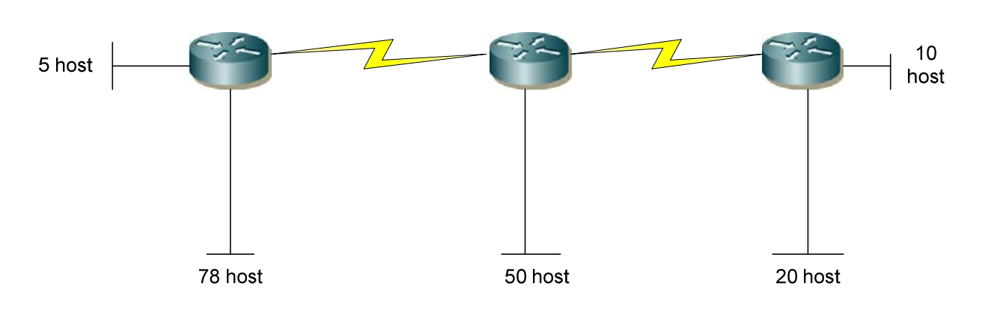

__Bài 1:__ Cho mạng và số bit mượn. Giả sử hỗ trợ subnet zero. Hãy xác định:

- Số subnet có thể có. 
- Số host/subnet. 
- Với mỗi subnet, hãy xác định: địa chỉ mạng, địa chỉ host đầu, địa chỉ host cuối, địa chỉ broadcast (nếu số lượng mạng quá nhiều chỉ cần ghi ra một vài mạng đầu và mạng cuối), subnet mark và số prefix.
  
> a) 192.168.2.0/24 mượn 5 bit

- Số subnet có thể có: 2^5^ = 32
- Số host/subnet: 2^3^-2 = 6
- Các địa chỉ mạng có octet bị chia cắt (octet thứ 4) là bội số của 8
- Liệt kê các mạng như sau:
  
192.168.2.0/29 -> địa chỉ mạng
192.168.2.1/29 -> địa chỉ đầu 
192.168.2.6/29 -> địa chỉ cuối
192.168.2.7/29 -> địa chỉ broadcast
255.255.255.248 -> subnet mask

---

192.168.2.8/29 -> địa chỉ mạng
192.168.2.9/29 -> địa chỉ đầu 
192.168.2.14/29 -> địa chỉ cuối
192.168.2.15/29 -> địa chỉ broadcast
255.255.255.248 -> subnet mask

---

192.168.2.16/29 -> địa chỉ mạng
192.168.2.17/29 -> địa chỉ đầu 
192.168.2.22/29 -> địa chỉ cuối
192.168.2.23/29 -> địa chỉ broadcast
255.255.255.248 -> subnet mask

---

192.168.2.248/29 -> địa chỉ mạng
192.168.2.249/29 -> địa chỉ đầu 
192.168.2.254/29 -> địa chỉ cuối
192.168.2.255/29 -> địa chỉ broadcast
255.255.255.248 -> subnet mask

>b) 192.168.12.0/24 mượn 3 bit

- Số subnet có thể có: 2^3^ = 8
- Số host/subnet: 2^5^ - 2 = 30
- octet thứ 4 bị cắt là bội số của 32
- Liệt kê các mạng như sau:

192.168.12.0/27 -> địa chỉ mạng
192.168.12.1/27 -> địa chỉ đầu 
192.168.12.30/27 -> địa chỉ cuối
192.168.12.31/27 -> địa chỉ broadcast
255.255.255.224 -> subnet mask

---

192.168.12.32/27 -> địa chỉ mạng
192.168.12.33/27 -> địa chỉ đầu 
192.168.12.62/27 -> địa chỉ cuối
192.168.12.63/27 -> địa chỉ broadcast
255.255.255.224 -> subnet mask

..................................

192.168.12.224/27 -> địa chỉ mạng
192.168.12.225/27 -> địa chỉ đầu 
192.168.12.254/27 -> địa chỉ cuối
192.168.12.255/27 -> địa chỉ broadcast
255.255.255.224 -> subnet mask

>c) 172.16.2.0/24 mượn 2 bit

- Số subnet có thể có: 2^2^ = 4
- Số host/subnet: 2^6^ - 2 = 62
- octet thứ 4 bị cắt là bội số của 64
- Liệt kê các mạng như sau: 

172.16.2.0/26 -> địa chỉ mạng
172.16.2.1/26 -> địa chỉ đầu
172.16.2.62/26 -> địa chỉ cuối
172.16.2.63/26 -> địa chỉ broadcast
255.255.255.192 -> subnet mask

--- 

172.16.2.64/26 -> địa chỉ mạng
172.16.2.65/26 -> địa chỉ đầu
172.16.2.126/26 -> địa chỉ cuối
172.16.2.127/26 -> địa chỉ broadcast
255.255.255.192 -> subnet mask

---

172.16.2.128/26 -> địa chỉ mạng
172.16.2.129/26 -> địa chỉ đầu
172.16.2.190/26 -> địa chỉ cuối
172.16.2.191/26 -> địa chỉ broadcast
255.255.255.192 -> subnet mask

--- 

172.16.2.192/26 -> địa chỉ mạng
172.16.2.193/26 -> địa chỉ đầu
172.16.2.254/26 -> địa chỉ cuối
172.16.2.255/26 -> địa chỉ broadcast
255.255.255.192 -> subnet mask

>d) 172.16.0.0/16 mượn 3 bit

- Số subnet có thể có: 2^3^ = 8
- Số host/subnet: 2^13 - 2 = 8190
- octet 3 bị cắt là bội số của 64
- Liệt kê các mạng như sau:

172.16.0.0/19 -> địa chỉ mạng
172.16.0.1/19 -> địa chỉ đầu
172.16.63.254/19 -> địa chỉ cuối
172.16.63.255/19 -> địa chỉ broadcast
255.255.224.0 -> subnet mask

---

172.16.64.0/19 -> địa chỉ mạng
172.16.64.1/19 -> địa chỉ đầu
172.16.127.254/19 -> địa chỉ cuối
172.16.127.255/19 -> địa chỉ broadcast
255.255.224.0 -> subnet mask

---

172.16.192.0/19 -> địa chỉ mạng
172.16.192.1/19 -> địa chỉ đầu
172.16.255.254/19 -> địa chỉ cuối
172.16.255.255/19 -> địa chỉ broadcast
255.255.224.0 -> subnet mask

>e) 172.16.0.0/16 mượn 12 bit 

- Số subnet có thể có: 2^12^ - 2 = 4094
- Số host/subnet: 2^4^ - 2 = 14
- octet 4 bị cắt là bội số của 16
- Liệt kê các mạng như sau: 

172.16.0.0/28 -> địa chỉ mạng
172.16.0.1/28 -> địa chỉ đầu
172.16.0.14/28 -> địa chỉ cuối
172.16.0.15/28 -> địa chỉ broadcast
255.255.255.240 -> subnet mask

--- 

172.16.0.16/28 -> địa chỉ mạng
172.16.0.17/28 -> địa chỉ đầu
172.16.0.30/28 -> địa chỉ cuối
172.16.0.31/28 -> địa chỉ broadcast
255.255.255.240 -> subnet mask

---

172.16.0.240/28 -> địa chỉ mạng
172.16.0.241/28 -> địa chỉ đầu
172.16.0.254/28 -> địa chỉ cuối
172.16.0.255/28 -> địa chỉ broadcast
255.255.255.240 -> subnet mask

--- 

172.16.1.0/28 -> địa chỉ mạng
172.16.1.1/28 -> địa chỉ đầu
172.16.1.14/28 -> địa chỉ cuối
172.16.1.15/28 -> địa chỉ broadcast
255.255.255.240 -> subnet mask

---

172.16.1.240/28 -> địa chỉ mạng
172.16.1.241/28 -> địa chỉ đầu
172.16.1.254/28 -> địa chỉ cuối
172.16.1.255/28 -> địa chỉ broadcast
255.255.255.240 -> subnet mask

---

172.16.255.240/28 -> địa chỉ mạng
172.16.255.241/28 -> địa chỉ đầu
172.16.255.254/28 -> địa chỉ cuối
172.16.255.255/28 -> địa chỉ broadcast
255.255.255.240 -> subnet mask

>f) 10.0.0.0/8 mượn 5 bit

- Số subnet có thể có: 2^5^ = 32
- Số host/subnet: 2^19 -2 = 524286
- Octet thứ 2 bị cắt là bội số của 2^3^ =  8
- Liệt kê các mạng như sau:

10.0.0.0/13 -> địa chỉ mạng
10.0.0.1/13 -> địa chỉ đầu
10.7.255.254/13 -> địa chỉ cuối
10.7.255.255/13 -> địa chỉ broadcast
248.0.0.0 subnet mask

---

10.8.0.0/13 -> địa chỉ mạng
10.8.0.1/13 -> địa chỉ đầu
10.15.255.254/13 -> địa chỉ cuối
10.15.255.255/13 -> địa chỉ broadcast
248.0.0.0 subnet mask

---

10.16.0.0/13 -> địa chỉ mạng
10.16.0.1/13 -> địa chỉ đầu
10.31.255.254/13 -> địa chỉ cuối
10.31.255.255/13 -> địa chỉ broadcast
248.0.0.0 subnet mask

---

10.240.0.0/13 -> địa chỉ mạng
10.240.0.1/13 -> địa chỉ đầu
10.255.255.254/13 -> địa chỉ cuối
10.255.255.255/13 -> địa chỉ broadcast
248.0.0.0 subnet mask

>g) 10.0.0.0/8 mượn 10 bit

- Số subnet có thể có 2^10^ = 1024
- Số host/subnet: 2^14 - 2 = 16382
- Octet 3 bị cắt là bội số của 2^6^ = 64
- Liệt kê các mạng cụ thể là:

10.0.0.0/18 -> địa chỉ mạng
10.0.0.1/18 -> địa chỉ đầu
10.0.63.254/18 -> địa chỉ cuối
10.0.63.255/18 -> địa chỉ broadcast
255.255.192.0 ->subnet mask

---

10.0.192.0/18 -> địa chỉ mạng
10.0.192.1/18 -> địa chỉ đầu
10.0.255.254/18 -> địa chỉ cuối
10.0.255.255/18 -> địa chỉ broadcast
255.255.192.0 ->subnet mask

--- 

10.1.0.0/18 -> địa chỉ mạng
10.1.0.1/18 -> địa chỉ đầu
10.1.63.254/18 -> địa chỉ cuối
10.1.63.255/18 -> địa chỉ broadcast
255.255.192.0 ->subnet mask

---

10.1.192.0/18 -> địa chỉ mạng
10.1.192.1/18 -> địa chỉ đầu
10.1.255.254/18 -> địa chỉ cuối
10.1.255.255/18 -> địa chỉ broadcast
255.255.192.0 ->subnet mask

---

10.255.0.0/18 -> địa chỉ mạng
10.255.0.1/18 -> địa chỉ đầu
10.255.63.254/18 -> địa chỉ đích
10.255.63.255/18 -> địa chỉ broadcast
255.255.192.0 -> subnet mask

---

10.255.192.0/18 -> địa chỉ mạng
10.255.192.1/18 -> địa chỉ đầu
10.255.255.254/18 -> địa chỉ đích
10.255.255.255/18 -> địa chỉ broadcast
255.255.192.0 -> subnet mask

>h) 10.0.0.0/8 mượn 18 bit

- Số subnet có thể có: 2^18 = 262114
- Số host/subnet: 2^4 - 2 = 14
- Octet thứ 4 bị cắt là bội số của 16
- Liệt kê các mạng cụ thể là:

10.0.0.0/28 -> địa chỉ mạng
10.0.0.1/28 -> địa chỉ đầu
10.0.0.14/28 -> địa chỉ cuối
10.0.0.15/28 -> địa chỉ broadcast
255.255.255.240 -> subnet mask

---

10.0.0.16/28 -> địa chỉ mạng
10.0.0.17/28 -> địa chỉ đầu
10.0.0.30/28 -> địa chỉ cuối
10.0.0.31/28 -> địa chỉ broadcast
255.255.255.240 -> subnet mask

---

10.255.255.240/28 -> địa chỉ mạng
10.255.255.241/28 -> địa chỉ đầu
10.255.255.254/28 -> địa chỉ cuối
10.255.255.255/28 -> địa chỉ broadcast
255.255.255.240 -> subnet mask

__Bài 2__: Cho mạng 172.16.5.0/24. Hãy chia nhỏ sao cho phù hợp với sơ đồ sau.

_Lời giải:_

- Mạng 78 host

2^m^ - 2 ≥ 78 => m = 7 
m + n = 8 (mượn bit ở octet 4)
=> n = 1. 
Mượn 1 bit và dành mạng 172.16.5.0/25 cho 78 host.
Dải địa chỉ cho 78 host này là:
172.16.5.0/25 -> 172.16.5.127/25

- Mạng 50 host

2^m^ -2 ≥ 50 => m = 6
m + n = 8 => n = 2

Mượn 2 bit, mạng 172.16.5.0/24 được chia thành 4 mạng:
172.16.5.0/26
172.16.5.64/26
172.16.5.128/26
172.16.5.192/26

vì mạng 172.16.5.0/26 và mạng 172.16.5.127/26 đã dùng cho mạng 78 host. Vì thế sử dụng dải  mạng 172.16.5.128/26 -> 172.16.5.191/26 cho mạng 50  host

- Mạng 20 host

2^m^ - 2 ≥ 20 => m = 5
m + n = 8 ( mượn bit octet 4)
=> n = 3
Mượn 3 bit

Dải địa chỉ được gắn cho mạng 20 host:
172.16.5.192/27 -> 172.16.5.223/27

- Mạng 10 host 

2^m^ - 2 ≥ 10 => m = 4
m + n = 8 => n = 4. Mượn 4 bit

Dải địa chỉ được sử dụng cho mạng 10 host:
172.16.5.224/28 -> 172.16.5.239/28

- Mạng 5 host

2^m^ - 2 ≥ 5 => m = 3
m + n = 8 => n = 5 

Dải địa chỉ được sử dụng cho mạng 5 host:
172.16.5.240/29 -> 172.16.5.247/29

- Mạng 3 host 

2^m^ - 2 ≥ 3 => m = 2
m + n = 8 => n = 6

Dải mạng được sử dụng cho 2 liên kết serial:
172.16.5.248/30 -> 172.16.5.251/30
172.16.5.252/30 -> 172.16.5.255/30

__Bài 3:__ Cho các địa chỉ host sau đây. Hãy xác định các địa chỉ subnet tương ứng và cho biết địa chỉ này có thể dùng đặt cho host được không:
a) 192.168.1.130/29  
/29 có 29 bit mạng, Octet chia cắt là octet thứ 4, số bit mượn của octet này là 3 -> bước nhảy 8. lấy 130/8 = 16
Host này thuộc mạng 192.168.1.128/29
Subnet mark: 255.255.255.248
Có thể dùng để đặt cho host
b) 172.16.34.57/18
Host này thuộc mạng: 172.16.0.0/18
Có thể dùng để đặt cho host
c) 203.162.4.191/28
Host này thuộc mạng: 203.162.4.176/28
Có thể dùng để đặt cho host
d) 1.1.1.1/30
Host này thuộc mạng 1.1.1.0/30
Không thể đặt làm host
e) 10.10.10.89/29
Host này thuộc mạng: 10.10.10.88/29
Có thể đặt làm host
f) 70.9.12.35/30
Host này thuộc mạng: 70.9.12.32/30
Có thể đặt làm host
g) 158.16.23.208/29
Không thể đặt làm host vì nó là địa chỉ mạng  

__Bài 4:__ Hãy tóm tắt các địa chỉ sau đây về thành 1 địa chỉ mạng đại điện:
a) 
192.168.0.0/24
192.168.1.0/24
192.168.2.0/24
192.168.3.0/24
b) 
172.16.16.0/24
172.16.20.0.24
172.16.24.0/24
172.16.28.0/24

___Lời giải:___

a)
192.168.|000000|00.0
192.168.|000000|01.0
192.168.|000000|10.0
192.168.|000000|11.0

=> 192.168.0.0/22

b)
172.16.|000|10000.0
172.16.|000|10100.0
172.16.|000|11000.0
172.16.|000|11100.0

=> 172.16.0.0/19