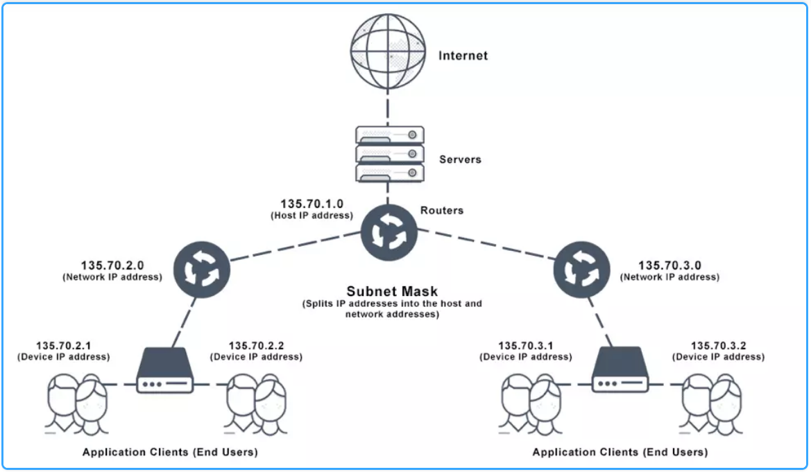

# Subnet

Subnet hay còn gọi là mạng con, là một phần của mạng lớn hơn được tách ra để quản lý dải địa chỉ IP một cách hiệu quả hơn. Khi bạn chia một mạng lớn thành các mạng con nhỏ hơn, bạn tạo ra các phân đoạn của mạng riêng biệt, giúp tối ưu hóa quản lý và tài nguyên mạng. Các máy tính trong cùng một mạng con có thể giao tiếp trực tiếp với nhau mà không cần thông qua cổng mạng chính của mạng lớn.

# Subnet mask

Subnet Mask là một con số 32-bit (trong IPv4) hoặc 128-bit (trong IPv6) được sử dụng để xác định phần của địa chỉ IP mạng và phần của địa chỉ IP host. Nó xác định rõ ràng rằng các bit nào trong địa chỉ IP được dùng cho mạng con và các bit nào được dùng cho host.

# Prefix

Để mô tả một địa chỉ IP, người ta dùng một đại lượng khác được gọi là số prefix. Số prefix có thể hiểu một cách đơn giản là số bit mạng trong một địa chỉ IP, được viết ngay sau địa chỉ IP, và được ngăn cách với địa chỉ này bằng một dấu “/”. Ví du: 192.168.1.1/24, 172.16.0.0/16 hay 10.0.0.0/8