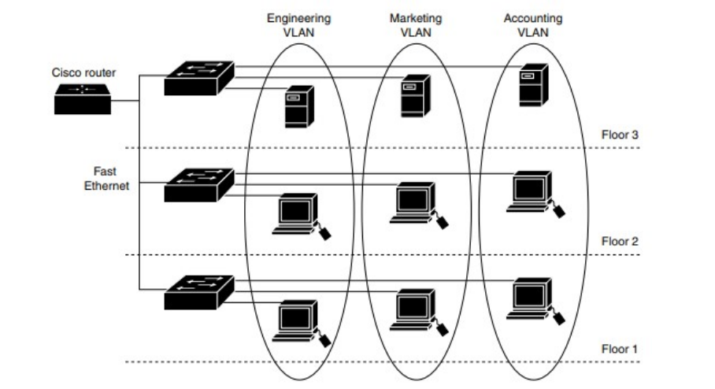

# Tìm hiểu VLAN  

### _1. VLAN là gì?_

- VLAN là viết tắt của Virtual Local Area Network, hay còn được gọi là mạng LAN ảo. VLAN là một công nghệ mạng được sử dụng để phân chia một mạng vật lý thành nhiều mạng ảo độc lập với nhau trên cùng một thiết bị chuyển mạch (switch).

Với VLAN, các thiết bị trên mạng vật lý được chia thành các nhóm khác nhau, có thể là theo địa chỉ IP, theo tên miền, theo chức năng hoặc theo bất kỳ tiêu chí nào khác. Các thiết bị trong cùng một VLAN có thể giao tiếp với nhau nhưng không thể truy cập vào các thiết bị của các VLAN khác. Điều này cung cấp tính bảo mật cho mạng và giúp giảm tải cho các thiết bị mạng.

- Nếu không có mạng Virtual LAN, một broadcast được gửi từ host có thể dễ dàng đi đến mọi thiết bị mạng. Khi đó, tất cả thiết bị đều sẽ xử lý những frame đã nhận broadcast đó. Việc này sẽ làm tăng đáng kể chi phí cho CPU trên mỗi thiết bị, đồng thời làm giảm khả năng bảo mật của hệ thống.

- Nếu ta đặt các interface trên các switch ở những VLAN riêng biệt, một broadcast từ host A chỉ có thể đi đến các thiết bị khả dụng ở trong cùng một Virtual LAN. Các host của Virtual LAN sẽ không hề biết về cách thức giao tiếp.

### _2. Phân loại VLAN_

#### Static VLAN (VLAN tĩnh)

- Static VLAN là loại VLAN được tạo ra bằng cách gắn các cổng Switch vào một VLAN. Cách làm này tương tự như việc một thiết bị được kết nối vào mạng và nó tự mình công nhận bản thân là VLAN của cổng đó.
- Trong trường hợp người dùng cần thay đổi các cổng và có nhu cầu truy cập vào một VLAN chung, quản trị viên phải khai báo cổng cho VLAN trong lần kết nối tiếp theo.

#### Dynamic VLAN (VLAN động)

- Được biết Dynamic VLAN là loại VLAN được tạo ra bằng cách sử dụng những phần mềm điển hình như Ciscowork 2000. Khi này người dùng sẽ sử dụng VLAN Management Policy Server (VMPS) để đăng ký các cổng Switch kết nối tới VLAN tự động. Quá trình kết nối được thực hiện dựa trên địa chỉ MAC nguồn của loại thiết bị được kết nối tới cổng.
- Tương tự như mô hình thiết bị mạng, Dynamic VLAN hoạt động truy vấn một cơ sở dữ liệu dựa trên VMPS của các VLAN thành viên còn lại.

### _3. Phạm vi VLAN_

| VLANs | Phạm vi | Sử dụng | Hỗ trợ VTP |
|-------|---------|---------|------------|
| 0,4095 |  | Chỉ sử dụng cho hệ thống, bạn không thể sử dụng VLAN này | N/A |
| 1 |  | Cisco default, bạn có thể sử dụng VLAN này nhưng không thể xóa | Có |
| 2-1001 | | Sử dụng cho Ethernet VLAN, bạn có thể tạo sử dụng và xóa | Có |
| 1002-1005 |  | Cisco default cho FDDI (fiber distributed data interface) và Token Ring, bạn không thể xóa | Có |
| 1006-4096 | Extended | Chỉ sử dụng cho Ethernet VLANs. Khi cấu hình VLANs extended, chú ý: Layer 3 port và một số features yêu cầu internal VLANs. Internal VLANs phân bổ từ 1006 trở lên. Bạn không thể sử dụng VLAN phân bổ cho sử dụng như vậy. Để xem VLANs sử dụng Internal, thực hiện câu lệnh _show vlan internal usage_. Switch catalyst không hỗ trợ cấu hình VLANs 1006-4096. Bạn phải kích hoạt extended system ID để sử dụng VLANs extended | Không |

Nếu bạn cấu hình switch là mode VTP server hay VTP transparent, bạn có thể cấu hình Vlan ở global mode hoặc configuration mode. Sau khi cấu hình Vlan, thông tin Vlan sẽ được lưu trong file vlan.dat, không lưu trữ trong file running-config hay startup-config. Để hiển thị Vlan đã cấu hình, sử dụng câu lệnh _show vlan_ 

Nếu switch hoạt động ở mode Transparent , sử dụng câu lệnh copy running-config startup-config để lưu cấu hình Vlan, sau khi thực hiện lưu trong starup-config, thực hiện câu lệnh show running-config hoặc starup-config để xem cấu hình Vlan

### _4. Cách hoạt động của VLAN_

- Các Virtual LAN ở trong mạng được xác định bằng một con số cụ thể
- Phạm vi giá trị hợp lệ là 1- 4094. Trên một switch VLAN, ta có thể chỉ định các cổng với số VLAN thích hợp.
- Tiếp đến, switch sẽ cho phép dữ liệu cần được gửi giữa các port khác nhau có cùng một Virtual LAN.
- Vì hầu hết các mạng đều có nhiều hơn là chỉ một switch duy nhất. Vì vậy, cần có một cách nào đó để có thể gửi lưu lượng giữa hai switch trong mạng. Cách đơn giản nhất chính là gán một port trên mỗi switch của Virtual LAN và chạy một cable giữa chúng.

### _5. Ứng dụng của VLAN_ 

- Tăng tính bảo mật: VLAN giúp tăng tính bảo mật cho mạng bằng cách phân chia mạng vật lý thành nhiều mạng ảo độc lập với nhau. Việc phân chia này giúp ngăn chặn các cuộc tấn công từ các thiết bị không được phép trong cùng một VLAN và giảm thiểu sự lan truyền của các thông tin bảo mật trên toàn mạng.
- Quản lý dễ dàng: VLAN giúp quản lý mạng dễ dàng hơn bằng cách phân chia mạng vật lý thành các mạng ảo độc lập với nhau tùy thuộc vào các tiêu chí nhất định. Việc này giúp cho việc quản lý mạng trở nên dễ dàng hơn.
- Giảm tải mạng: VLAN giúp giảm tải mạng bằng cách giảm lượng thông tin broadcast và multicast trên mạng. Khi một địa chỉ broadcast được gửi trên mạng vật lý, nó sẽ ảnh hưởng đến tất cả các thiết bị trên mạng. Khi chia mạng vật lý thành các VLAN, các địa chỉ broadcast chỉ được gửi đến các thiết bị trong cùng VLAN, giảm tải cho các thiết bị không cần nhận địa chỉ broadcast.
- Tăng cường hiệu suất: VLAN giúp tăng cường hiệu suất mạng bằng cách tối ưu hóa lưu lượng truyền thông giữa các thiết bị trong cùng VLAN. Việc tối ưu hóa này giúp giảm thời gian chờ đợi trong việc truyền thông giữa các thiết bị và tăng tốc độ truyền thông trên mạng.
- Phân tích lưu lượng mạng: VLAN giúp phân tích và quản lý lưu lượng truyền thông trên mạng. Việc này giúp người quản trị mạng có thể quản lý và giám sát lưu lượng mạng một cách hiệu quả hơn.