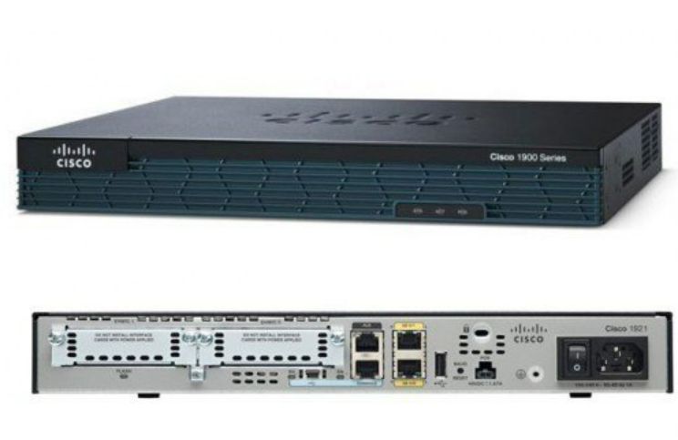
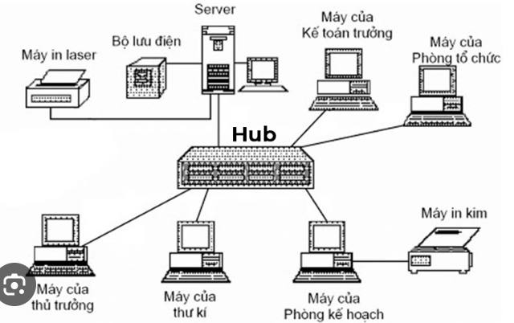

# Tìm hiểu về thiết bị mạng

### 1. Router

___Khái niệm___

- Router (thiết bị định tuyến hoặc bộ định tuyến) là thiết bị mạng dùng để chuyển các gói dữ liệu đến các thiết bị đầu cuối. Nói một cách dễ hiểu, Router là một thiết bị để chia sẻ Internet tới nhiều các thiết bị khác trong cùng lớp mạng.

___Cấu tạo của Router___

_a. Bộ nhớ_
- Bảng mạch chính (Main board): có nhiệm vụ liên kết các linh kiện điện tử của router với nhau để phối hợp hoạt động.
- CPU (Central Processing Unit): có nhiệm vụ là điều kiển các vụ làm việc của Router như tính toán các chương trình định tuyến, tìm đường đi cho các gói tin trong mạng,….chịu trách nhiệm thực hiện tính toán chính của thiết bị.
- RAM (Random Access Memory): có nhiệm vụ là chịu trách nhiệm xử lý tất cả các yêu cầu lưu trữ ngắn hạn cho bộ định tuyến. Bao gồm các lệnh cấu hình của quản trị viên mạng như NAT, ACL, …. Ngoài ta bảng định tuyến chứa thông tin quan trọng như địa chỉ IP nguồn và đích của gói dữ liệu và các số liệu cho phép bộ định tuyến xác định tuyến đường hiệu quả nhất khi gửi dữ liệu. Lưu ý là mọi thứ được lưu trữ trên RAM của bộ định tuyến sẽ bị mất nếu thiết bị bị tắt.
- ROM (Read-Only Memory): bộ nhớ chỉ đọc hay ROM là bộ nhớ lưu trữ dài hạn cho bộ định tuyến. Không giống như RAM của bộ định tuyến, mọi thứ được lưu trữ trên ROM sẽ không bị mất khi thiết bị tắt nguồn. Phần mềm bootstrap được lưu trữ trên ROM của bộ định tuyến.
- NVRAM (Non Volatile Random Access Memory): là viết tắt của bộ nhớ truy cập ngẫu nhiên không bay hơi. Không giống như RAM, dữ liệu không bị mất sau khi thiết bị tắt nguồn và có nhiệm vụ là lưu file cấu hình Startup-config.
- Flash có nhiệm vụ là lưu file hệ điều hành IOS (Internetwork Operation System) của router.

_b. Cổng_
- Có nhiều loại cổng trên Router là Serial Interface, Ethernet Interface, Fast Ethernet Interface, Giga Ethernet Interface.

___Quá trình khởi động của Router___

Qúa trình khởi động của Router trải qua các bước như sau:
Bước 1: Mở nguồn cho Router
Bước 2:  Bootstrap chạy chương trình POST (Power On Self Test)
Bước 3: Bootstrap kiểm tra giá trị Thanh ghi cấu hình để chỉ định nơi tải IOS. Theo mặc định (giá trị mặc định của Thanh ghi cấu hình là 2102, ở hệ thập lục phân), bộ định tuyến trước tiên sẽ tìm kiếm các lệnh “boot system” trong tệp startup-config. Nếu tìm thấy lệnh, nó sẽ chạy các lệnh khởi động hệ thống theo thứ tự chúng xuất hiện trong cấu hình khởi động để định vị hệ điều hành. Nếu không, tệp hệ điều hành sẽ được tải từ Flash. Nếu không tìm thấy hệ điều hành (IOS) trong Flash, bootstrap có thể thử tải hệ điều hành từ máy chủ TFTP hoặc từ ROM (mini-IOS).
Bước 4: Sau khi tìm thấy hệ điều hành, hệ điều hành sẽ khởi chạy.
Bước 5: Sau đó hệ điều hành sẽ tải tệp cấu hình (startup-confing) từ NVRAM vào RAM. Nếu không tìm thấy cấu hình khởi động trong NVRAM, thì hệ điều hành sẽ cố gắng tải tệp cấu hình từ TFTP. Nếu không có máy chủ TFTP nào phản hồi, bộ định tuyến sẽ vào Chế độ thiết lập (Chế độ cấu hình ban đầu).

___Các chế độ cấu hình của Router___

a.Chế độ người dùng: ở chế độ này thì người cấu hình chỉ sử dụng được những câu lệnh giám sát cơ bản.
b.Chế độ đặc quyền: ở chế độ này người cấu hình sẽ thực thi được các câu lệnh cao cấp hơn như ping, show run, show ip,…..Để vào được chế độ này thì ở chế độ người dùng ta gõ: Router> → Router →enable → Enter
c. Chế độ cấu hình (Configuration Mode): ở chế độ này người cấu hình có thể toàn quyền điều kiển router bằng các câu lệnh như đặt IP, mật khẩu, định tuyến,….Để vào được chế độ này ở chế độ đặc quyền ta gõ: Router# → Router#configuration terminal → Enter
d. Chế độ ROMMON: khi ở chế độ này ta có thể khôi phục mật khẩu, xóa mật khẩu hoặc mặc định Router.

### 2. Switch layer 2

___Định nghĩa___

- Bộ chuyển mạch switch layer 2 là một loại switch mạng hoặc thiết bị hoạt động trên lớp liên kết dữ liệu (OSI Layer 2) và sử dụng địa chỉ MAC để xác định đường dẫn thông qua nơi các khung sẽ được chuyển tiếp.
- Switch layer 2 sử dụng các kỹ thuật chuyển mạch dựa trên phần cứng để kết nối và truyền dữ liệu trong mạng cục bộ (LAN). Một chuyển mạch layer 2 switch cũng có thể được gọi là một cầu nối bridge đa kênh.
- Chuyển mạch Switch L2 chịu trách nhiệm chính về việc truyền dữ liệu trên lớp vật lý và thực hiện kiểm tra lỗi trên mỗi khung được truyền và nhận. Một chuyển mạch L2 switching yêu cầu địa chỉ MAC của NIC trên mỗi nút mạng để truyền dữ liệu.
- Nó tự động tìm địa chỉ MAC bằng cách sao chép địa chỉ MAC của mỗi khung nhận được hoặc nghe các thiết bị trên mạng và duy trì địa chỉ MAC của chúng trong bảng chuyển tiếp. Điều này cũng cho phép L2 Switch gửi nhanh khung đến các nút đích.
- Tuy nhiên, giống như các switch lớp khác (3,4 trở đi), một chuyển mạch switch lớp 2 (L2) không thể truyền tải gói tin trên địa chỉ IP và không có bất kỳ cơ chế nào để ưu tiên các gói dựa trên ứng dụng gửi / nhận.

___Nguyên lý hoạt động và chức năng của switch layer 2 Cisco___

_Nguyên lý hoạt động_
Chuyển mạch switch lớp 2 là thiết bị mạng chuyển tiếp lưu lượng dựa trên địa chỉ lớp MAC (Ethernet hoặc Token Ring).

Công nghệ cầu nối đã được khoảng từ những năm 1980 (và thậm chí có thể sớm hơn). Bridge liên quan đến việc phân đoạn các mạng cục bộ (LAN) ở cấp lớp 2. Một bridge thường tìm hiểu về các địa chỉ điều khiển truy cập phương tiện (MAC) trên mỗi cổng của nó và chuyển các khung MAC một cách minh bạch đến các cổng đó.

Những bridge này cũng đảm bảo rằng các frame được đặt cho các địa chỉ MAC nằm trên cùng một cổng với trạm gốc không được chuyển tiếp đến các cổng khác. Vì mục đích của cuộc thảo luận này, chúng tôi chỉ xem xét các mạng LAN Ethernet.

Thiết bị chuyển mạch lớp 2 có hiệu quả cung cấp chức năng tương tự. Chúng tương tự như các bridge đa dạng ở chỗ chúng học và chuyển tiếp các frame trên mỗi cổng. Sự khác biệt chính là sự tham gia của phần cứng đảm bảo rằng nhiều đường dẫn chuyển đổi bên trong switch có thể hoạt động cùng một lúc.

_Chức năng_
Có ba chức năng của switch layer 2 riêng biệt:
1. Địa chỉ-address learning
2. các quyết định chuyển tiếp/lọc – forward/filter decisions
3. tránh vòng lặp – loop avoidance

__Địa chỉ__
Switch layer 2 và bridge nhớ địa chỉ phần cứng nguồn của mỗi khung nhận được trên một giao diện và chúng nhập thông tin này vào cơ sở dữ liệu MAC được gọi là bảng chuyển tiếp / bộ lọc.
__Chuyển tiếp / quyết định lọc__
Khi một frame được nhận trên một giao diện, switch sẽ nhìn vào địa chỉ phần cứng đích và tìm thấy giao diện thoát trong cơ sở dữ liệu MAC. Khung chỉ được chuyển tiếp ra cổng đích được chỉ định.
__Tránh vòng lặp__
Nếu nhiều kết nối giữa các switch được tạo cho mục đích dự phòng, các vòng lặp mạng có thể xảy ra. Giao thức cây spanning (STP) được sử dụng để ngăn chặn các vòng lặp mạng trong khi vẫn cho phép dự phòng.

### 3. Switch layer 3

___Khái niệm___
- Switch hay còn được gọi là thiết bị chuyển mạch, là loại thiết bị dùng trong kết nối các đoạn mạch với nhau theo mô hình dạng sao. Nó đóng vai trò nhận các tín hiệu vật lý và chuyển đổi chúng thành dữ liệu, kiểu tra địa chỉ đích gửi rồi đến cổng tương ứng.
- Switch layer 3 đảm bảo được nhiều tính năng hơn layer 2 tiêu biểu như có thể lưu được bảng cập nhật địa chỉ MAC của thiết bị kết nối. Bên cạnh đó, nó còn có thêm bảng định tuyến của một Router. Vì vậy, đôi khi chứng ta bắt gặp một thiết bị switch như một router nhưng nó không có cổng kết nối Wan với nhau.
- Tuy không có cổng kết nối Wan nhưng switch layer 3 đã thể hiện là router tốc độ cao cùng chức năng định tuyến như Router để có thể liên thông với các mạng con hay VLANS. Bên cạnh đó, vẫn đảm bảo sự định tuyến giữa chúng và hệ thống hoạt động ổn định hơn mà không cần đến sự hỗ trợ của thiết bị định tuyến Router.

___Chức năng của switch layer 3___
- thernet tốc độ cao layer3 có chức năng kết cấu. Thiết bị này giúp định tuyến router để liên thông với các mạng con khác hoặc với Campus. Ngoài ra, nó còn có thể liên thông với những mạng con trong mạng VLANS. 
- Hỗ trợ truyền tải tập tin với tính bảo mật cao dựa trên tính năng ACL. Khi thực hiện truyền tại, các tập tin được truyền tới đúng điểm đến và điểm kết nối. Do vậy, hạn chế được tối đa rủi ro gặp phải với các truy cập ngoài quyền kết nối.
- Việc tra cứu địa chỉ MAC thực hiện qua bảng FIB và bản CAM
- Ngoài có các chức năng cao cấp như switch layer 2 vừa có thể thực hiện các nhiệm vụ, hoạt động của cả layer 3 và 4.
- Có thể phát hiện lặp lại và kiểm tra ARP giúp ngăn chặn được các rủi ro xày ra, mang lại độ bảo mật cao.

___So sánh switch layer 2 và switch layer 3___

|Chỉ tiêu so sánh|Switch layer 2|Switch layer 3|
|---------|------------|--------------|
|Giao thức, IP, QoS|Thực hiện thủ công|Chỉ giới hạn ở IP, thực hiện phân loại QoS dựa trên IP|
|Kết cấu|Chỉ có thể truy xuất cập nhật địa chỉ MAC có trong frame|Thực hiện định tuyến như một router, có thể liên thông với các mạng con hay VLANs|
|Tính năng|   | Có thêm tính năng ACL
Ngăn chặn được các kết nối nằm ngoài quyền truy cập|
|Bảng FIB|Không trang bị bảng FIB|Đảm nhiệm vai trò chuyển tiếp các gói tin và chứa đựng các nội dung như: địa chỉ IP, IP next hop, MC next hop và port đích|
|Tra cứu địa chỉ MAC| Chỉ có thể thực hiện tra cứu trên bảng CAM|Tra cứu trên bảng CAM và FIB|
|Hoạt động|   | Vừa có chức năng cao cấp như switch layer 2 vừa thực hiện một số nhiệm vụ, hoạt động trên thông tin của layer 3 và 4.|
|Bảo mật|  | Tính năng xác thực 802.1x, phòng ngừa QoS. Phát hiện lặp lại và kiểm tra ARP. Hoạt động an toàn ở nhiều nơi.|

### 4. Hub
___Khái niệm___
Hub là một thiết bị mạng cơ bản được sử dụng để kết nối nhiều máy tính hay thiết bị điện tử khác nhau trong cùng mạng LAN. Một Hub có từ 4 đến 24 cổng, đóng vai trò như một trung tâm kết nối. Khi dữ liệu được chuyển đến một cổng thì hub sẽ sao chép và chuyển đến các cổng khác.

___Các loại Hub___
1. Passive Hub
Passive hub hoạt động khá thụ động, và không cải thiện hiệu suất truyền mạng. Nó đơn giản chỉ nhận dữ liệu trên một cổng và sau đó phát tới tất cả các cổng.
2. Active Hub
Active hub có thêm một số tính năng nâng cấp so với passive hub. Nó có thể giám sát dữ liệu được gửi đến thiết bị kết nối nào. Nhờ sử dụng công nghệ store (store technology) để kiểm tra dữ liệu trước khi gửi đi và đánh giá gói tin nào cần được ưu tiên chuyển trước. Active hub có thể tùy chọn để sửa chữa các gói tin lỗi hay điều hướng/phân phối gói tin còn lại.
3. Smart Hub
Smart hub có nhiều ưu việt hơn so với passive hub và active hub. Ngoài các chức năng tương tự hai loại trên, smart hub có thêm chip điều khiển cho phép tự động phát hiện, chẩn đoán lỗi trên các thiết bị vật lý. Nhờ đó, nó cũng giúp rà soát các thiết bị nào trong mạng hoạt động kém.

___Đặc điểm của Hub___
__Hub__ không phân chia nhiệm bị cho bất kỳ cổng nào do đó dữ liệu sẽ được truyền đến tất cả các cổng. Do đó, trong quá trình sử dụng, nếu cổng hub nào gặp sự cố, hoàn toàn có thể sử dụng dữ liệu tại một cổng khác.
Hiện nay, hub là bộ chia mạng được nhiều cá nhân, tổ chức lựa chọn. Vậy hub có những đặc điểm gì nổi trội mà trở nên được ưa chuộng như vậy? Sau đây là một số đặc biệt điểm nổi trội của Hub:
- Hub hoạt động với chức năng là băng thông chia sẻ và phát trực tuyến. 
- Các thiết bị hub hoạt động trên lớp vật lý của mô hình OSI và cung cấp hỗ trợ phát trực tuyến bán song công (half-duplex).
- Ngoài ra, trong quá trình, các xung đột có thể phát sinh khi thiết lập lên đường truyền, chủ yếu trong hub, khi nhiều máy tính đồng thời gửi dữ liệu đến các cổng cao tương ứng đến các thiết bị khác nhau.

___So sánh Hub và Switch___
- Giống nhau: 
  - Chịu trách nhiệm  kết nối nhiều máy tính và thiết bị điện tử trong cùng một hệ thống mạng. 
  - Khuếch đại tín hiệu và chuyển gói  đến các cổng.
- Khác nhau:

|Tiêu chí| Hub (Bộ chia mạng)|Switch (thiết bị chuyển mạch)|
|------|---------|----------|
|Cách chuyển dữ liệu|Khi dữ liệu đến từ một cổng, hub sẽ sao chép nó và phân phối nó đến các cổng còn lại|Switch phân tích dữ liệu đến và xác định nguồn và đích  để quản lý truyền chính xác|
|Cơ chế hoạt động|Hub đang chạy ở chế độ. Half duplex, tức là chỉ gửi hoặc nhận dữ liệu cùng một lúc|Với cơ chế full duplex có thể gửi và  nhận dữ liệu cùng một lúc|

### 5. Firewall

___Khái niệm___
Tường lửa (Firewall) là một hệ thống an ninh mạng, có thể dựa trên phần cứng hoặc phần mềm, sử dụng các quy tắc để kiểm soát traffic vào, ra khỏi hệ thống. Tường lửa hoạt động như một rào chắn giữa mạng an toàn và mạng không an toàn. Nó kiểm soát các truy cập đến nguồn lực của mạng thông qua một mô hình kiểm soát chủ động.

___Cách hoạt động___
Khi Firewall hoạt động thì có thể từ chối hoặc cho phép lưu lượng mạng giữa các thiết bị dựa trên các nguyên tắc mà nó đã được cấu hình hoặc cài đặt bởi một người quản trị tường lửa đưa ra.
Có rất nhiều firewall cá nhân như  Windows  firewall hoạt động trên một tập hợp các thiết lập đã được cài đặt sẵn. Như vậy thì người sử dụng không cần lo lắng về việc phải cấu hình firewall như thế nào. Nhưng ở một mạng lớn thì việc cấu hình firewall là cực kỳ quan trọng để tránh khỏi các hiểm họa có thể có xảy trong mạng.