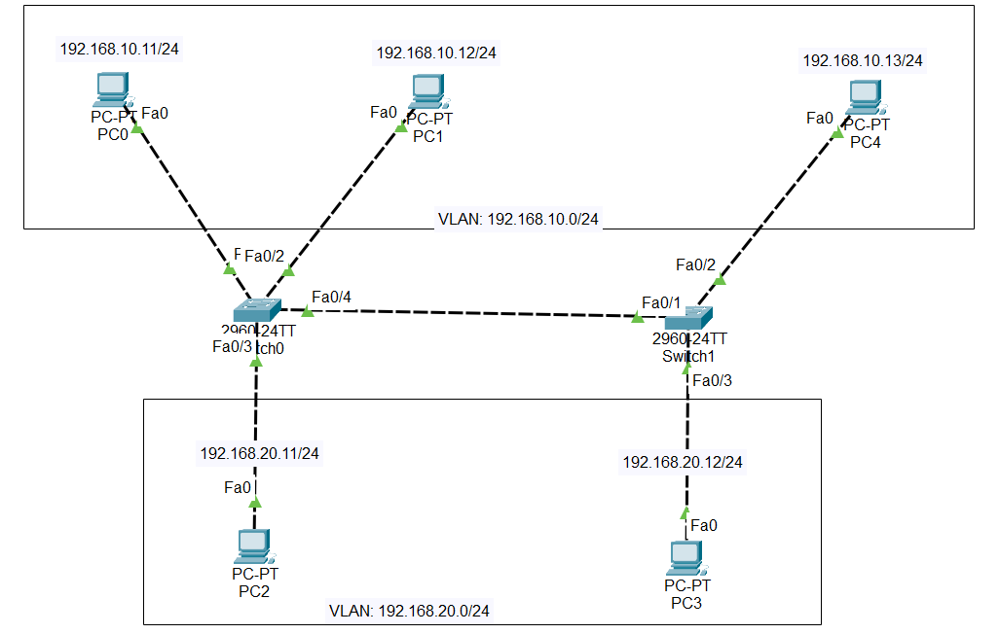
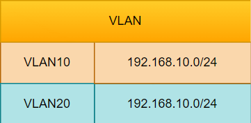
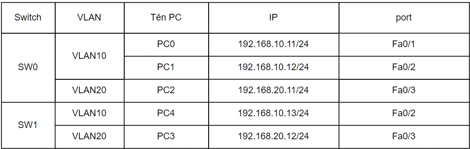

# Cấu hình VTP domain

### VTP domain là gì?
VTP domain (hay còn được gọi là VLAN managerment domain) bao gồm 1 SW hoặc một vài SW kết nối với nhau với nhiệm vụ quản trị 1 VTP domain name. 1 SW chỉ có thể nằm trong 1 VTP domain.
Xét trong hệ thống có 30 Switch: tất cả các Switch đều có VLAN 10, 20, 30, 40, 50 và tên của các VLAN như IT, Sale.... Bình thường ta phải đi cấu hình lần lượt 30 Switch nhưng khi dùng VTP thì chỉ cần cấu hình các VLAN trên một Switch Server sau đó đồng nhất với các Switch còn lại là xong.
VTP là VLAN Trunking Protocol. Là giao thức độc quyền của thiết bị Cisco. Nó cho phép triển khai đồng nhất nhiều VLAN cùng một lúc xuống nhiều Switch khác nhau trong hệ thống mạng lớn.
### Các mode hoạt động 
**1. VTP server**
- Có quyền tạo VLAN, Sửa VLAN, Xóa VLAN
- Có quyền gửi thông tin đi cho các Switch khác
- Có thể học thông tin từ Switch khác sau đó chuyển đi cho switch khác học

**2. VTP Client**
- Không thể tạo, sửa, xóa VLAN
- Nó có thể gửi đi thông tin đi cho SW khác học.

**3. Mode Transparent**
- Có thể tạo, sửa, xóa VLAN nhưng chỉ trong nộ bộ của Switch đó thôi
- Không đồng bộ cũng không gửi thông tin cấu hình đi cho người khác.
- Làm trạm trung chuyển các thông tin quảng bá của VTP tới Client

___Chú ý:___ Khi nào thì dùng Transparent: Trên SW Server có 5 VLAN: 2 tới 5. Nhưng VLAN 2 là phòng Sale có nhiều nhân viên nên cần có SW mở rộng nhiều cổng. Lúc này trên SW transparent chỉ cần cấu mình mình VLAN 2. SW transparent sẽ không cập nhật thông tin của các VLAN khác.

### Cách thức hoạt động của giao thức VTP
#### Điều kiện để VTP hoạt động
- Ta có tất cả các Switch được kết nối tới một Switch tổng bằng đường Trunking.
- Toàn bộ các Switch này được đặt trong một miền là Dnu nó sẽ trao đổi thông tin được với nhau.
#### Các bước hoạt động
**Bước 1:** Khi có thay đổi thông tin trên con Switch tổng như sửa, xóa tên hoặc thông tin VLAN thì chỉ số VTP Revision sẽ tăng lên 1.
=> Số Revision là bộ đếm khi có sự thay đổi trong cơ sở dữ liệu của VLAN. Mỗi lần sửa nó sẽ tăng lên 1.
**Bước 2:** Khi Revision tăng ngay lập tức các gói tin sẽ gửi tới các Switch trong miền thông qua đường Trunk. Cứ 5 phút nó lại gửi một lần.
**Bước 3:** Các Switch còn lại trong miền sẽ so sánh chỉ số Revision. Nếu thấy thông tin đến có chỉ số Revision cao hơn nó sẽ cập nhật dữ liệu.
#### Xây dựng Backup cho hệ thống
Để tăng tính dự phòng người ta thường dùng tối hiểu 2 Switch hoạt động ở chế độ Server.
=> Điều kiện bình thường: khi có sự thay đổi trên Switch Server 1 thì Switch Server 2 sẽ học. Nó sẽ đảm bảo duy trì cho thệ thống.
=> Điều kiện thay đổi: khi một Switch Server cắm vào hệ thống mới nếu chỉ số Revision cao hơn Server hiện tại nó sẽ làm sai lệch thông tin VLAN. Bởi vậy trước khi cắm vào phải chuyển nó sang mode Client hoặc Transparen rồi mới chuyển lại mode Server.
#### Chống tấn công DoS dùng VTP
Để chống tấn công DoS ta đặt mật khẩu VTP
#### VTP Pruning
- Chống lãng phí lưu lượng đường truyền (dành cho hệ thống có VTP Server và VTP Transparent)
- Khi bật tính năng này từ Switch Server các Switch Client sẽ học.
- Khi Client nhận được VTP Pruning nó sẽ thông báo lại có những VLAN nào trên nó. Khi một gói tin từ một VLAN gửi đi Switch Server sẽ biết và không gửi vào những Switch không có VLAN đó.
### Cấu hình VTP domain
__Sơ đồ lab:__


__Quy hoạch VLAN:__
- VLAN10: 192.168.10.0/24
- VLAN20: 192.168.20.0/24



__Quy hoạch IP và port:__


__Cấu hình VTP__
__1. Đặt IP cho các PC theo phân hoạch__
__2. Thiết lập VLAN trên 2 switch__
**Trên SW 0**
Đặt tên:
```Switch>enable 
Switch#configure terminal 
Switch(config)#hostname SW1
SW1(config)#
```
Tạo VLAN10 và VLAN20:
```
SW1(config)#vlan 10
SW1(config-vlan)#name VLAN10
SW1(config-vlan)#exit

SW1(config)#vlan 20
SW1(config-vlan)#name VLAN20
SW1(config-vlan)#exit

SW1(config)#
```
Gán các port vào đúng các VLAN định sẵn:
```
SW1(config)#interface fastEthernet 0/10
SW1(config-if)#switchport access vlan 10
SW1(config-if)#exit

SW1(config)#interface fastEthernet 0/11
SW1(config-if)#switchport access vlan 10
SW1(config-if)#exit

SW1(config)#interface fastEthernet 0/20
SW1(config-if)#switchport access vlan 20
SW1(config-if)#exit

SW1(config)#exit
```
Kiểm tra lại:
```
SW1#show vlan

VLAN Name                             Status    Ports
---- -------------------------------- --------- ---------------
...

10   VLAN10                           active    Fa0/10, Fa0/11
20   VLAN20                           active    Fa0/20

....
```
__Trên SW1__
Đặt tên:
```
Switch>enable 
Switch#configure terminal 
Switch(config)#hostname SW2
SW2(config)#
```
Tạo VLAN10 và VLAN20:
```
SW2(config)#vlan 10
SW2(config-vlan)#name VLAN10
SW2(config-vlan)#exit

SW2(config)#vlan 20
SW2(config-vlan)#name VLAN20
SW2(config-vlan)#exit

SW2(config)#
```
Gán các port và đúng các VLAN định sẵn:
```
SW2(config)#interface fastEthernet 0/10
SW2(config-if)#switchport access vlan 10
SW2(config-if)#exit

SW2(config)#interface fastEthernet 0/20
SW2(config-if)#switchport access vlan 20
SW2(config-if)#exit

SW2(config)#exit
```
Kiểm tra lại:
```
SW2#show vlan

VLAN Name                             Status    Ports
---- -------------------------------- --------- -----
...

10   VLAN10                           active    Fa0/10
20   VLAN20                           active    Fa0/20

...
```
__3. Cấu hình VTP__
**Đặt IP cho các interface VLAN trên 2 switch**
Đặt địa chỉ IP cho interface VLAN10 của SW1 là _192.168.10.1_ và VLAN20 là _192.168.20.1_
```
SW1#configure terminal 
SW1(config)#interface vlan 10
SW1(config-if)#
SW1(config-if)#ip address 192.168.10.1 255.255.255.0
SW1(config-if)#no shutdown
SW1(config-if)#exit
SW1(config)#

SW1(config)#interface vlan 20
SW1(config-if)#ip address 192.168.20.1 255.255.255.0
SW1(config-if)#no shutdown 
SW1(config-if)#exit 

SW1(config)#exit
SW1#
```
Đặt địa chỉ IP cho interface VLAN10 của SW2 là _192.168.10.2_ và VLAN20 là _192.168.20.2_
```
SW2#configure terminal 
SW2(config)#interface vlan 10
SW2(config-if)#
SW2(config-if)#ip address 192.168.10.2 255.255.255.0
SW2(config-if)#no shutdown
SW2(config-if)#exit
SW2(config)#

SW2(config)#interface vlan 20
SW2(config-if)#ip address 192.168.20.2 255.255.255.0
SW2(config-if)#no shutdown 
SW2(config-if)#exit 

SW2(config)#exit
SW2#
```
__Thiết lập VTP server và VTP client__
Mặc định thì Catalyst switch sẽ được cấu hình làm VTP Server. Giờ ta sẽ thiết lập:
- Switch 0: VTP Server
- Switch 1: VTP CLient.

__Tạo đường Trunk từ SW1 đến SW2

Ta sẽ bật trunking trên các port nối giữa 2 switch là Fa0/1 trên SW1 và Fa0/1 trên SW2.
**SW1**
```
SW1#configure terminal 
SW1(config)#interface fastEthernet 0/1
SW1(config-if)#switchport mode trunk 
SW1(config-if)#end
SW1#
```
**SW2**
```
SW2#configure terminal 
SW2(config)#interface fastEthernet 0/1
SW2(config-if)#switchport mode trunk 
SW2(config-if)#end
SW2#
```
Lưu ý: Nếu gặp lỗi khi cấu hình mode trunk cho port
```
SW1(config-if)#switchport mode trunk
Command rejected: An interface whose trunk encapsulation is "Auto" can not be configured to "trunk" mode.
```
Điều này có nghĩa là do bạn đang thiếu kiểu đóng gói (có thể là 802.1Q) trên port đó.
Để xử lý, ta sử dụng lệnh dưới:
```
switchport trunk encapsulation dot1q
```
Sau đó thực hiện lại cấu hình mode trunk như bình thường.

__4. Các câu lệnh kiểm tra khi cấu hình xong__

```
SW# show vtp status

SW# show vtp pasword

SW# show vlan

SW# show interfaces trunk
```

__Tham khảo__ 
https://www.daihockhonggiay.com/blogs/post/vtp

