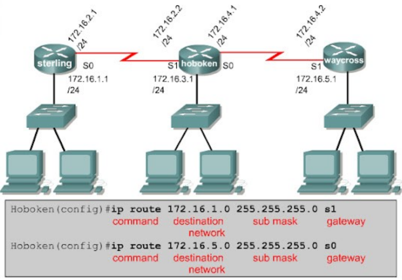
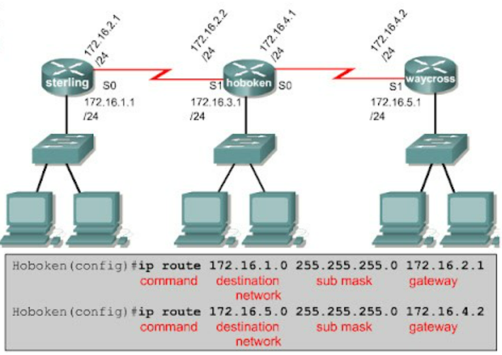

# Tìm hiểu về Routing

### _1. Khái niệm_

- Định tuyến là phương thức mà Router (Bộ định tuyến) hay PC (thiết bị mạng) dùng để chuyển các gói tin đến địa chỉ đích một cách tối ưu nhất, nghĩa là chỉ ra hướng và đường đi tốt nhất cho gói tin.
- Quá trình Routing dựa vào thông tin trên bảng định tuyến (Routing table), là bảng chứa các lộ trình nhanh và tốt nhất đến các mạng khác nhau trên mạng, để hướng các gói dữ liệu đi một cách hiệu quả nhất.
- Routing –table là một dạng database cần thiết để tìm đường đi nhanh nhất (Path determination), nó thể được xây dựng thông qua nhiều cách, có thể là do cấu hình của người quản trị và cũng có thể được tích hợp trong các giao thức định tuyến.

### _2. Cách thức hoạt động_

- Dữ liệu di chuyển dọc theo bất kỳ mạng nào dưới dạng gói dữ liệu. Mỗi gói dữ liệu có một tiêu đề chứa thông tin về điểm đích dự kiến của gói. Khi gói di chuyển đến đích của mình, một số bộ định tuyến có thể định tuyến gói đó nhiều lần. Các bộ định tuyến thực hiện quy trình này hàng triệu lần mỗi giây với hàng triệu gói.

- Khi một gói dữ liệu đến, trước tiên, bộ định tuyến sẽ tra cứu địa chỉ của gói trong bảng định tuyến. Quá trình này tương tự như một hành khách tham khảo lịch trình xe buýt để tìm tuyến xe buýt tốt nhất tới điểm đích của mình. Sau đó, bộ định tuyến chuyển tiếp hoặc di chuyển gói đến điểm tiếp theo trong mạng.

### _3. Các giao thức định tuyến chính_

- Giao thức định tuyến là một tập hợp các quy tắc xác định cụ thể cách bộ định tuyến xác định và chuyển tiếp các gói dọc theo đường dẫn mạng. Các giao thức định tuyến được nhóm thành hai hạng mục riêng biệt: giao thức cổng nội bộ và giao thức cổng bên ngoài.

- Giao thức cổng nội bộ hoạt động tốt nhất trong hệ thống tự trị – mạng được một tổ chức duy nhất kiểm soát về mặt quản trị. Các giao thức cổng bên ngoài quản lý tốt hơn việc truyền thông tin giữa hai hệ thống tự trị.

#### ***Giao thức cổng nội bộ
Những giao thức này đánh giá hệ thống tự trị và đưa ra quyết định về định tuyến dựa trên các chỉ số khác nhau, chẳng hạn như sau:
- Số bước nhảy hoặc số lượng bộ định tuyến giữa nguồn và điểm đích
- Thời gian trì hoãn hoặc thời gian dùng để gửi dữ liệu từ nguồn đến điểm đích
- Băng thông hoặc dung lượng liên kết giữa nguồn và điểm đích

Sau đây là một số ví dụ về giao thức cổng nội bộ.

___Giao thức thông tin định tuyến___
Giao thức thông tin định tuyến (RIP) dựa vào số bước nhảy để xác định đường dẫn ngắn nhất giữa các mạng. RIP là một giao thức cũ mà hiện nay không ai sử dụng vì giao thức này không có khả năng điều chỉnh quy mô tốt để triển khai mạng lớn hơn.

___Giao thức Mở đường dẫn ngắn nhất đầu tiên___
Giao thức Mở đường dẫn ngắn nhất đầu tiên (OSPF) thu thập thông tin từ tất cả các bộ định tuyến khác trong hệ thống tự trị để xác định tuyến đường ngắn nhất và nhanh nhất đến điểm đích của một gói dữ liệu. Bạn có thể triển khai OSPF bằng cách sử dụng các thuật toán định tuyến hoặc quy trình máy tính khác nhau.

#### ***Giao thức cổng bên ngoài
Giao thức cổng đường biên (BGP) là giao thức cổng bên ngoài duy nhất.

___Giao thức cổng đường biên___
BGP xác định hoạt động giao tiếp qua Internet. Internet là một tập hợp lớn gồm các hệ thống tự trị mà tất cả đều được kết nối với nhau. Mỗi hệ thống tự trị có số hệ thống tự trị (ASN) có được bằng cách đăng ký với Tổ chức cấp phát số hiệu Internet.

BGP hoạt động bằng cách theo dõi các ASN gần nhất và ánh xạ địa chỉ đích tới ASN tương ứng của chúng.

### _4. Phân loại_ 

___Định tuyến tĩnh (static routing)___

  - Static Routing là phương thức định tuyến mà người quản trị sẽ nhập tất cả thông tin về đường đi cho router. Vậy khi cấu trúc hệ thống mạng có bất kỳ sự thay đổi nào thì người quản trị sẽ thay đổi bằng cách xóa hay thêm các thông tin về đường đi cho router, nói cách khác đường đi này là cố định.

- ___Nguyên lý hoạt động___

  - Đầu tiên người quản trị sẽ cấu hình các đường cố định cho router
  - Sau đó, router sẽ cài đặt đường đi này vào bảng định tuyến
  - Và gói dữ liệu được định tuyến theo đường cố định 
  
Đường đi cố định có 3 cách:

- Cổng ra: 

- IP cổng kế cận:

- Default Route: xét về câu lệnh cấu hình cũng tương tự như 2 dạng trên chỉ có khác một điều là không cần biết địa chỉ đích và Subnet Mask.

-----
___Tài liệu tham khảo___:
https://aws.amazon.com/vi/what-is/routing/
https://vnpro.vn/thu-vien/the-nao-la-routing-2042.html
https://vnpro.vn/thu-vien/khai-niem-va-cau-hinh-dinh-tuyen-tinh-2347.html
https://vnpro.vn/thu-vien/static-route-la-gi-2045.
