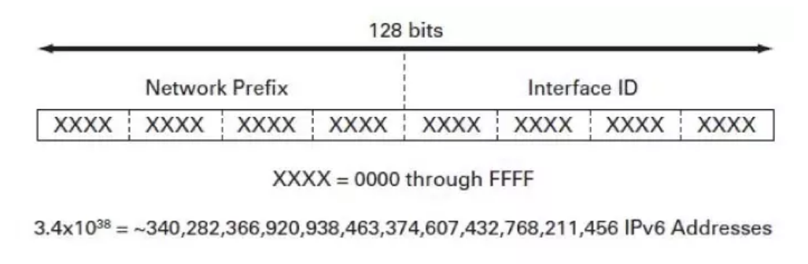
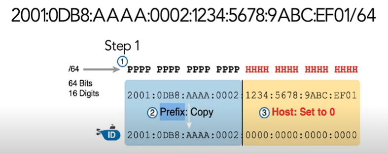
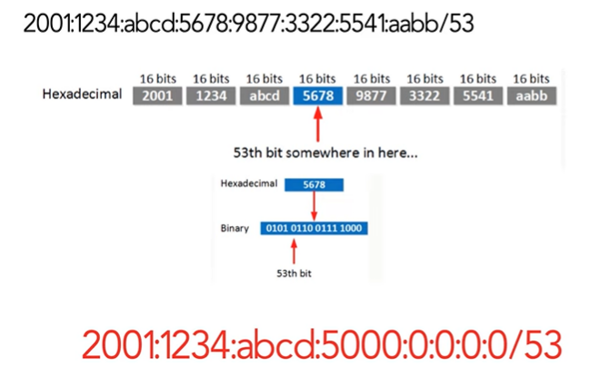
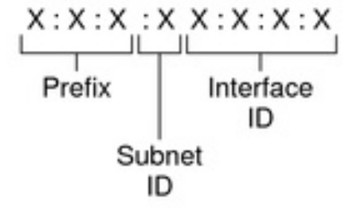
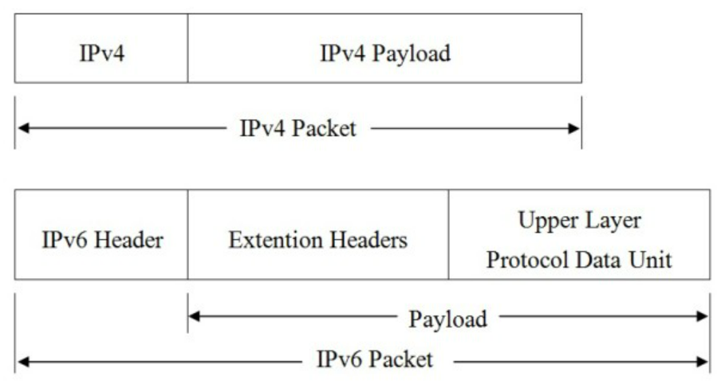
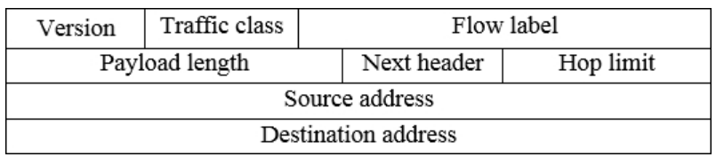
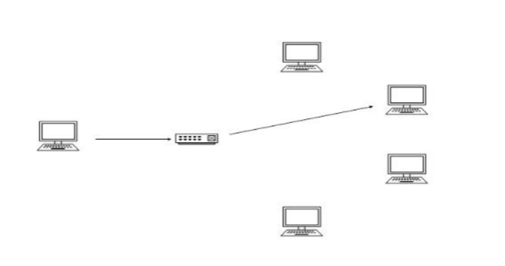
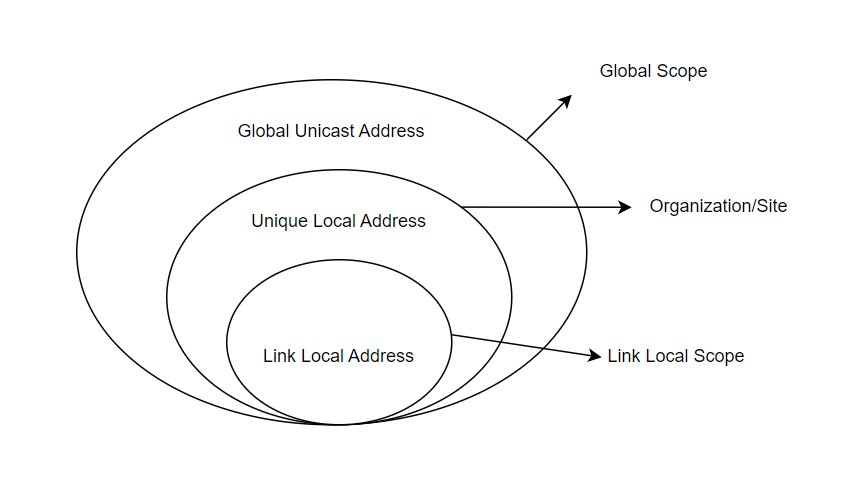
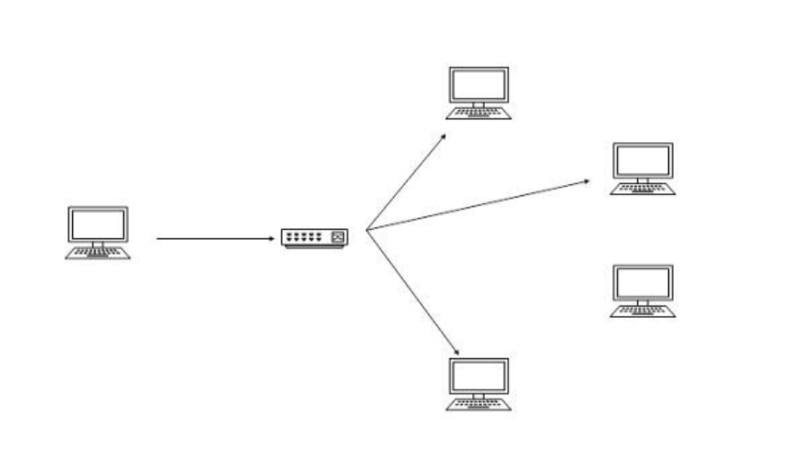
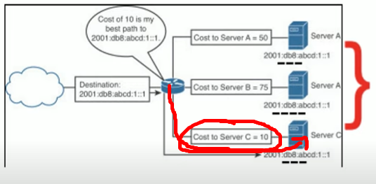

# Tìm hiểu về IPv6
### 1. IPv6 là gì?

Địa chỉ IPv6 (Internet Protocol Version 6) là thế hệ địa chỉ Internet phiên bản mới được thiết kế để thay thế cho phiên bản địa chỉ IPv4 trong hoạt động Internet.
Do sự phát triển như vũ bão của mạng và dịch vụ Internet, nguồn IPv4 dần cạn kiệt, đồng thời bộc lộ các hạn chế đối với việc phát triển các loại hình dịch vụ hiện đại trên Internet. Phiên bản địa chỉ Internet mới IPv6 được thiết kế để thay thế cho phiên bản IPv4, với hai mục đích cơ bản:
- Thay thế cho nguồn IPv4 cạn kiệt để tiếp nối hoạt động Internet.
- Khắc phục các nhược điểm trong thiết kế của địa chỉ IPv4.

### 2. Cấu trúc - thành phần của IPv6
__Biểu diễn địa chỉ IPv6__

IPv6 sử dụng 128 bit địa chỉ trong khi IPv4 chỉ sử dụng 32 bit; nghĩa là IPv6 có tới 2^128 địa chỉ khác nhau. Đây là một con số rất lớn. Các nhà nghiên cứu chỉ ra rằng chúng ta sẽ không bao giờ sử dụng hết địa chỉ IPv6.

Địa chỉ IPv6 có chiều dài 128 bít, biểu diễn dưới dạng các cụm số hexa phân cách bởi dấu ":", 
ví dụ 2001:0DC8::1005:2F43:0BCD:FFFF. Với 128 bít chiều dài, không gian địa chỉ IPv6 gồm 2128 địa chỉ, cung cấp một lượng địa chỉ khổng lồ cho hoạt động Internet.
Những địa chỉ này lớn, khả năng cung cấp địa chỉ cho nhiều node và cung cấp cấu trúc phân cấp linh hoạt, nhưng nó không dễ để viết ra. Vì vậy cần có 1 số nguyên tắc để nhằm rút ngắn lại cách biểu diễn địa chỉ IPv6. Sau đây là các quy tắc để rút gọn IPv6:
- Cho phép bỏ các số 0 nằm trước mỗi nhóm (octet).
- Thay bằng số 0 cho nhóm có toàn số 0.
- Thay bằng dấu "::" cho các nhóm liên tiếp nhau có toàn số 0.

_Ví dụ về nén địa chỉ IPv6:_ Cho một địa chỉ: 1080:0000:0000:0070:0000:0989:CB45:345F, dựa theo các quy tắc đã nêu trên, có thể nén địa chỉ IP trên như sau: 1080::70:0:989:CB45:345F hoặc 1080:0:0:70::989: CB45:345F
___Chú ý___: Dấu "::" chỉ sử dụng được 1 lần trong toàn bộ địa chỉ IPv6 (nhiều dấu "::" có thể gây ra sự nhầm lẫn hoặc không thể biết đúng vị trí của các octet trong địa chỉ IPv6).

__Biểu diễn của Address Prefixes và Subnet ID__

Prefix của địa chỉ IPv6 được biểu diễn tương tự với kí hiệu IPv4 CIDR. IPv6 prefix được biểu diễn như sau: IPv6-address/ prefix-length.
Trong đó: IPv6-address là bất kì địa chỉ có giá trị, Prefix-length là số bit liền kề nhau được bao gồm trong prefix.

Nếu Prefix-length là /P, sử dụng quy tắc sau: 
- Copy lại P bit
- Các bit còn lại chuyển về bit 0

Khi P là bội của 4, chỉ cần quan tâm đến chữ số Hex, có nghĩa là mỗi chứ số hex sẽ được sao chép hoặc thay đổi thành 0.

Khi P không chia hết cho 4, lúc này quan tâm đến bit: 

__Các thành phần của IPv6__

- __Site Prefix:__ Đây là thông số được gán với website thông qua ISP. Do đó, toàn bộ máy tính ở cùng vị trí sẽ chia sẻ với nhau bằng một site prefix. Có thể thấy, đặc tính của site prefix là khi đã nhận ra mạng của người dùng và cho phép truy cập thông qua internet thì nó sẽ hướng đến việc dùng chung.
- __Subnet ID:__ Đây là thành phần bên trong website. Nó được dùng để miêu tả cấu trúc site của mạng. Vì thế, một IPv6 subnet sẽ có cấu trúc tương đương một nhánh mạng đơn.
- __Interface ID:__ Cấu trúc của nó tương tự ID trong IPv4. Các thông số sẽ nhận dạng một host riêng. Interface ID có cấu hình tự động.

Ví dụ: Địa chỉ IPv6 có cấu trúc: 2001:0f68:0000:0000:0000:0000:1986:69af bao gồm:
- Prefix: 2001:0f68:0000
- Subnet ID: 0000
- Interface ID: 0000:0000:1986:69af

__Cấu trúc IPv6 gồm 2 phần:__

- __Payload:__ là sự kết hợp của Extension và PDU.Thông thường có thể lên tới 65535 byte.PDU thường bao gồm header của giao thức tầng cao và độ dài của nó, còn Extension là những thông tin liên quan đến dịch vụ kèm theo trong IPv6 được chuyển tới một trường khác và nó có thể có hoặc không.
  - Uper Layer Protocol Data Unit (PDU): Thường bao gồm header của giao thức tầng cao và độ dài của nó.
  - Extention Headers:
    - Những thông tin liên quan đến dịch vụ kèm theo trong IPv6 được chuyển tới một trường khác gọi là header mở rộng Extension Header.
    - Extension Header là đặc tính mới chỉ có trong IPv6.
    - Trường Extension Header có thể có hoặc không.

Extension Header là tuỳ chọn. Nó sẽ không được gắn thêm vào nếu các dịch vụ thêm vào không được sử dụng. Nên Extension Header có độ dài không cố định. Trong cấu trúc Header IPv6, có thể thấy 8 bits của trường Next Header. Trường này sẽ xác định xem Extension Header có được sử dụng hay không. Khi Extension Header không được sử dụng, IPv6 Header sẽ chứa mọi thông tin ở Layer 3. Nếu Extension Header được sử dụng, trường Next Header trong Header của 1 gói tin IPv6 sẽ chỉ ra loại của Header tiếp theo sau. Các giá trị của trường Next Header:

|Next header type|Value| |
|----------|----------|----------|
|Hop-by-hop Options|00| Được sử dụng khi một trong số các options cần phải được sử lý bởi mỗi node trên đường từ nguồn đến đích. Thông thường chỉ có node đầu cuối xử lý Extension Header|
|IPv6|41|Để tạo đường hầm IPv6|
|Routing|43| Cho phép node gửi 1 gói tin đến 1 hoặc nhiều router để các router đó xử lý và định tuyến đến đích|
|Fragment|44|Được sử dụng khi nguồn gửi gói tin IPv6 gửi đi gói tin lớn hơn Path MTU (Maximum Transmision Unit). Những gói tin này phải được chia tại Layer 3 của node nguồn.|
|Authentication|51|Sử dụng phương pháp xác thức có độ an toàn cao|
|Destination Options|60|Giới hạn chỉ những node đích nào mới xử lý những option mà gói tin mang theo|
|Encapsulating Security Payload|50|ESP Header sử dụng để xác định những thông tin liên quan đến mã hóa dữ liệu được tổ hợp lại thành extension header|
|No next header|59|Không có header tiếp theo header này| 

- __IPv6 Header:__ là thành phần luôn phải có trong một gói tin IPv6 và cố định 40 bytes
  

  - Version: 4 bits giúp xác định phiên bản của giao thức.
  - Traffic class: 8 bits giúp xác định loại lưu lượng.
  - Flow label: 20 bits giá mỗi luồng dữ liệu.
  - Payload length: 16 bits (số dương).Giúp xác định kích thước phần tải theo sau IPv6 Header.
  - Next-Header: 8 bits giúp xác định Header tiếp theo trong gói  tin.
  - Hop Limit: 8 bits (số dương). Qua mỗi node, giá trị này giảm 1 đơn vị ( giảm đến 0 thì gói bị loại bỏ).
  - Source address: 128 bits mang địa chỉ IPv6 nguồn của gói tin.
  
Tuy Source Address và Destination Address lớn hơn gấp 4 lần số bit so với IPv4 nhưng tổng số bit trong Header không tăng nhiều so với IPv4 do Header trong IPv6 đã được làm đơn giản hơn so với IPv4, nhưng hoạt động hiệu quả.
### 3. Phân loại IPv6

Một địa chỉ IPv6 có thể được phân thành 1 trong 3 loại:

__Địa chỉ Unicast__
- __Unicast:__ Một địa chỉ unicast được định nghĩa duy nhất trên một cổng của một node IPv6. Một gói tin được gởi đến một địa chỉ unicast được đưa đến cổng được định nghĩa bởi địa chỉ đó.

Địa chỉ unicast gồm có 4 loại khác nhau :
- Global Unicast Address: tương ứng với địa chỉ public của IPv4, là loại địa chỉ được cho phép truy cập rộng rãi trên mạng internet, hỗ trợ cho việc định tuyến và đánh địa chỉ phân cấp.
  - Dải địa chỉ chính cho việc truyền dữ liệu trên Internet. 
  - Những địa chỉ có thể định tuyến Internet duy nhất trên tòan cầu.
- Link-Local Address: địa chỉ này luôn được cấu hình một cách tự động trên interface của một thiết bị. Địa chỉ này luôn bắt đầu với FE80. 16 bit đầu tiên của địa chỉ liên kết cục bộ luôn được đặt thành 1111 1110 1000 0000 (FE80). 48 bit tiếp theo được đặt thành 0, do đó nó chỉ được sử dụng để liên lạc giữa các máy chủ IPv6 trên một liên kết (phân đoạn quảng bá). Các địa chỉ này không thể định tuyến, do đó, Bộ định tuyến không bao giờ chuyển tiếp các địa chỉ này bên ngoài liên kết.
  - Dải địa chỉ Link-Local luôn bắt đầu với tiền tố "fe80::/10".
  - Các địa chỉ Link-Local tự động tạo ra và được sử dụng cho việc giao tiếp trong mạng cục bộ.
- IPv4-Compatible IPv6 Address: Đây là loại địa chỉ IPv6 được sử dụng để hỗ trợ việc chuyển đổi từ IPv4 sang IPv6. Địa chỉ này chứa một địa chỉ IPv4 trong địa chỉ IPv6 và có dạng "::IPv4", trong đó IPv4 là địa chỉ IPv4 của thiết bị.
  - Ví dụ: "::192.0.2.1" biểu diễn địa chỉ IPv6 có địa chỉ IPv4 tương ứng là 192.0.2.1.
- Unique-Local Address: được sử dụng trong phạm vi toàn cầu, dùng để thay thế cho địa chỉ site-local.
  - Dải địa chỉ ULA bắt đầu bằng các tiền tố fc00::/7 đến fdff::/7 và có nhiều phân đoạn cho các mục đích cụ thể.
  - Dải địa chỉ ULA được sử dụng trong mạng cục bộ (local network) và không được định cấu hình tự động bởi tổ chức quản lý phân vùng.

__Địa chỉ Multicast__
- __Multicast:__ Một địa chỉ multicast định nghĩa một nhóm các cổng IPv6. Một gói tin gởi đến địa chỉ multicast được xử lý bởi tất cả những thành viên của nhóm multicast.
- Dải địa chỉ Multicast luôn bắt đầu với tiền tố ff00::/8 tương đương với địa chỉ IPv4 224.0.0.0/4
  

Địa chỉ multicast cũng có các phạm vi: global, site-local, link-local ngoài ra multicast còn có thêm 2 phạm vi mới đó là organization-local và node-local. Một node IPv6 có thể được gắn rất nhiều địa chỉ.
- Organization-local: được sử dụng trong phạm vi một tổ chức với một số site.
- Node-local: chỉ có tính tương ứng trong phạm vi một node

__Địa chỉ Anycast__
- __Anycast:__ Một địa chỉ có thể gắn cho nhiều thiết bị. Một gói tin được gởi đến một địa chỉ anycast là được chuyển đến chỉ một trong số các thiết bị này, thường là gần nhất.
- Một địa chỉ Anycast sử dụng cùng một dải địa chỉ như địa chỉ Unicast toàn cầu.    

### 4. Các địa chỉ IPv6 đặc biệt 

|  |IPv6 Address|Meaning|
|------|------|-------|
|0:0:0:0:0:0:0:0/128|::/128|Địa chỉ không xác định|
|0:0:0:0:0:0:0:0|::/0|Tuyến đường mặc định|
|0:0:0:0:0:0:0:1/128|::1/128|Địa chỉ Loopback|

Địa chỉ dành riêng cho giao thức định tuyến:
|IPv6 Address|Giao thức định tuyến|
|---------|----------|
|FF02::5|OSPFv3|
|FF02::6|OSPFv3 Designated Routers|
|FF02::9|RIPng|
|FF02::A|EIGRP|

___Tài liệu tham khảo___
https://vnpro.vn/tin-tuc/cac-loai-dia-chi-ipv6-dac-biet-va-cau-truc-cua-ipv6-1009.html
https://www.totolink.vn/article/75-cau-truc-ipv6-va-cac-loai-dia-chi-ipv6.html
https://viblo.asia/p/tim-hieu-ve-ipv6-3P0lPyDG5ox
