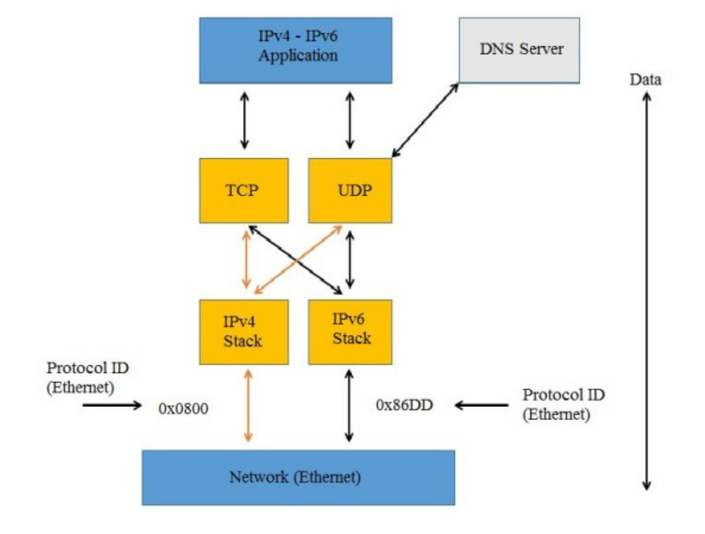
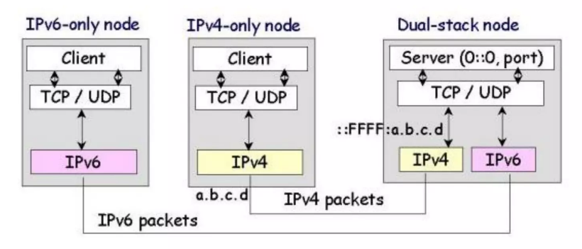

# Tìm hiểu về Dual Stack

### 1. Dual Stack

Dual Stack còn gọi là cơ chế chồng giao thức, là cơ chế cơ bản nhất cho phép nút mạng đồng thời hỗ trợ cả hai giao thức Ipv4 và Ipv6. Có được khả năng trên do một trạm Dual Stack cài đặt cả hai giao thức Ipv6 và Ipv4. Trạm Dual Stack sẽ giao tiếp bằng giao thức Ipv4 với các trạm Ipv4 và bằng giao thức Ipv6 với các trạm Ipv6.

__Cấu hình địa chỉ__

- Do hoạt động của cả hai giao thức, nút mạng kiểu này cần ít nhất một địa chỉ IPv4 và một địa chỉ IPv6. Địa chỉ IPv4 có thể được cấu hình trực tiếp hoặc thông qua cơ chế DHCP. Địa chỉ IPv6 được cấu hình trực tiếp hoặc thông qua khả năng tự động cấu hình địa chỉ. Dual stack đáp ứng được hầu hết các yêu cầu về phân giải DNS và lựa chọn địa chỉ.
- Trạng thái mặc định mà một nút phải quan sát là các câu hỏi DNS phải dự định phân giải cho địa chỉ IPv6 trước tiên, và nếu không hợp lệ sẽ quay trở lại địa chỉ IPv4. Các node sử dụng cơ chế của IPv4 (ví dụ DHCP) để yêu cầu các địa chỉ IPv4 và sử dụng các cơ chế giao thức IPv6 (ví dụ tự cấu hình địa chỉ không trạng thái) để yêu cầu địa chỉ IPv6.
- Ưu điểm của Dual Stack: đây là cơ chế cơ bản nhất để nút mạng có thể hoạt động đồng thời với cả hai giao thức nên nó được hỗ trợ trên nhiều nền tảng hệ điều hành khác nhau như: FreeBSD, Linux, Solaris, Window. Cơ chế này dễ triển khai, cho phép duy trì các kết nối bằng cả hai giao thức IPv4, IPv6.
- Nhược điểm của cơ chế Dual Stack: cấu hình mạng có thể sử dụng hai bảng định tuyến và hai quy trình định tuyến thuộc hai giao thức định tuyến. IPv6 có cơ chế bảo mật tích hợp còn IPv4 thì lại phải có phần mềm riêng nên khả năng mở rộng kém vì phải sử dụng địa chỉ IPv4.

__Nguyên tắc hoạt động của Dual Stack__

Một cách để một node triển khai IPv6 và vẫn duy trì sự tương thích với node IPv4 đó là sử dụng song song 2 giao thức IPv4 và IPv6. Một node sẽ cấu hình cả 2 giao thức được gọi là node IPv6/IPv4. Node này có thể liên lạc với IPv6 sử dụng gói tin IPv6 và với IPv4 sử dụng gói tin IPv4. Node IPv6/IPv4 thường nằm ở 2 đầu của nút mạng IPv4 trong mô hình chuyển đổi IPv6 và IPv4. Một node IPv6/IPv4 phải được cấu hình cả địa chỉ IPv6 và IP4. Địa chỉ IPv4 tương thích có thể được xem như một địa chỉ duy nhất, nó có thể sử dụng như một địa chỉ IPv6 hay một địa chỉ IPv4. Toàn bộ 128 bit biểu diễn địa chỉ IPv6, trong đó 32 bit bậc thấp biểu diễn địa chỉ IPv4.

### 2. Cơ chế nối trực tiếp IPv6 (IPv6-only)

- Nối trực tiếp IPv6 là một phương pháp trong đó mạng hoạt động hoàn toàn trên IPv6, không hỗ trợ IPv4.
-  Để cho phép các thiết bị trong mạng IPv6-only truy cập Internet sử dụng IPv4, một gateway chuyển đổi IPv6 sang IPv4 (gọi là NAT64) được triển khai. NAT64 giúp dịch các gói tin và địa chỉ từ IPv6 sang IPv4 và ngược lại. Điều này cho phép các thiết bị IPv6-only truy cập các trang web và dịch vụ IPv4.
- Mô hình này thúc đẩy việc chuyển đổi hoàn toàn sang IPv6, giúp giảm bớt phức tạp của Dual Stack và tiết kiệm tài nguyên hệ thống.
- Tuy nhiên, việc triển khai IPv6-only đòi hỏi sự chắc chắn về khả năng hỗ trợ IPv6 của các ứng dụng và dịch vụ trong mạng. Nếu một số ứng dụng quan trọng vẫn cần IPv4, thì cần cân nhắc cách chuyển đổi hoặc sử dụng dịch vụ gắn thêm để hỗ trợ IPv4.

### 3. So sánh 

- Dual Stack cho phép sự chuyển đổi từ IPv4 sang IPv6 một cách trôi chảy và linh hoạt, trong khi IPv6-only yêu cầu mạng hoạt động hoàn toàn trên IPv6.
- IPv6-only có thể tiết kiệm tài nguyên IPv4, nhưng có thể gây khó khăn trong việc hỗ trợ các ứng dụng và dịch vụ cũ sử dụng IPv4.
- Dual Stack là một giải pháp trung gian cho đến khi IPv6 có thể đạt được sự hỗ trợ toàn diện và sẵn sàng cho việc chuyển đổi hoàn toàn sang IPv6.
- Tùy thuộc vào tình hình cụ thể của mạng và yêu cầu của tổ chức, Dual Stack hoặc IPv6-only có thể được lựa chọn để triển khai IPv6 trong mạng.