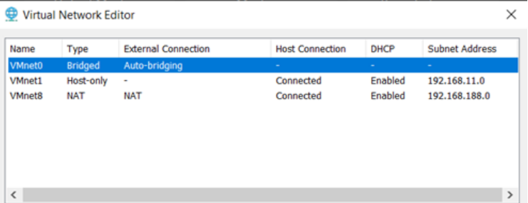
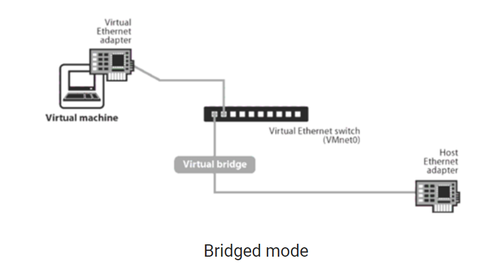
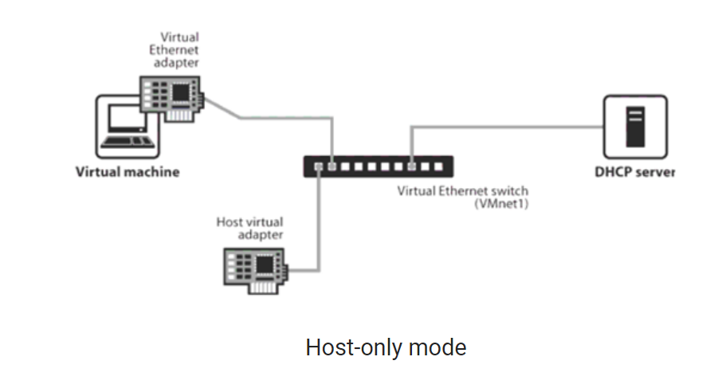
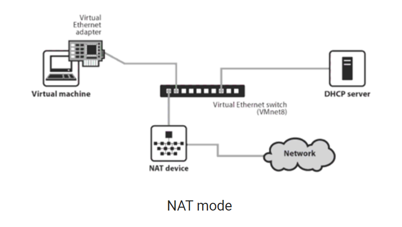

## Các chế độ hoạt động của VMware Network
Tương tự như Physical Network, VMware cũng sẽ có Virtual Switch để kết nối nhiều thiết bị trong cùng đường mạng. Để kiểm tra VMware Switch, bạn vào Edit rồi chọn Virtual Network.
Thông thường ở đây sẽ có 3 con hàng được dựng sẵn như sau:

## Bridge
Ở chế độ này, card mạng trên máy ảo được gắn vào VMnet0, VMnet0 này liên kết trực tiếp với card mạng vật lý trên máy thật, máy ảo lúc này sẽ kết nối internet thông qua  card mạng vật lý và có chung lớp mạng với card mạng vật lý.

- Card Bridge trên máy ảo chỉ có thể giao tiếp với card mạng thật trên máy thật.
- Card mạng Bridge này có thể giao tiếp với mạng vật lý mà máy tính thật đang kết nối.

__Ưu điểm__
- Máy ảo có thể truy cập Internet và tài nguyên mạng bên ngoài
- Cho phép máy ảo giao tiếp với các máy tính và thiết bị mạng ngoài một cách trực tiếp 
- Phù hợp cho việc phát triển web, kiểm tra mạng.

__Nhược điểm__
- Máy ảo  có các tiềm ẩn về vấn đề bảo mật khi truy cập trực tiếp Internet 
- Yêu cầu cấu hình thêm máy chủ vậy lý để hoạt động với mạng Bridge

__Các trường hợp nên sử dụng mạng Bridge__
- Sử dụng khi bạn cần máy ảo truy cập Internet và các tài nguyên mạng bên ngoài, chẳng hạn như máy tính trong mạng ngoài.

## Host-only
Máy ảo được kết nối với VMnet có tính năng Host-only, trong trường hợp này là VMnet1 . VNnet Host-only kết nối với  một card mạng ảo tương ứng ngoài máy thật. Ở chế độ này, các máy ảo không có kết nối vào mạng vật lý bên ngoài hay internet thông qua máy thật , có nghĩa là mạng VMnet Host-only và mạng vật lý hoàn toàn tách biệt. IP của máy ảo được cấp bởi DHCP của VMnet tương ứng. Trong nhiều trường hợp đặc biệt cần cấu hình riêng, ta có thể tắt DHCP trên VMnet và cấu hình IP bằng tay cho máy ảo.

 
- Card Host-only chỉ có thể giao tiếp với card mạng ảo VMnet1 trên máy thật.
- Card Host-only chỉ có thể giao tiếp với các card Host-only trên các máy ảo khác.
- Card Host-only không thể giao tiếp với mạng vật lý mà máy tính thật đang kết nối.

__Ưu điểm__
- Môi trường đóng kín cách ly hoàn toàn với mạng ngoài
- Máy ảo có thể giao tiếp với máy chủ và máy ảo khác trong cùng mạng host-only

__Nhược điểm__
- Không thể truy cập Internet hoặc tài nguyên mạng bên ngoài 
- Máy ảo không thể cộng tác với máy tính ngoài mạng 

__Các trường hợp sử dụng host-only__
- Sử dụng khi muốn tại môi trường thử nghiệm hoặc phát triển mà không liên quan đến Internet hoặc các mạng bên ngoài
- Phù hợp khi muốn giao tiếp với máy chủ và với các máy ảo trong cùng mạng host-only

## NAT
Ở chế độ này, card mạng của máy ảo kết nối với VMnet8, VNnet8 cho phép máy ảo đi ra mạng vật lý bên ngoài internet thông qua cơ chế NAT (NAT device). Lúc này lớp mạng bên trong máy ảo khác hoàn toàn với lớp mạng của card vật lý bên ngoài, hai mạng hoàn toàn tách biệt. IP của card mạng máy ảo sẽ được cấp bởi DHCP của VMnet8, trong trường hợp bạn muốn thiết lập IP tĩnh cho card mạng máy ảo bạn phải đảm bảo chung lớp mạng với VNnet8 thì máy ảo mới có thể đi internet.

- Card NAT chỉ có thể giao tiếp với card mạng ảo VMnet8 trên máy thật.
- Card NAT chỉ có thể giao tiếp với các card NAT trên các máy ảo khác.
- Card NAT không thể giao tiếp với mạng vật lý mà máy tính thật đang kết nối. Tuy nhiên nhờ cơ chế NAT được tích hợp trong VMWare, máy tính ảo có thể gián tiếp liên lạc với mạng vật lý bên ngoài.

__Ưu điểm:__
- Bảo vệ máy ảo khỏi mạng ngoài
- Dễ cài đặt và cấu hình 
- Máy ảo có thể truy cập Internet thông qua máy chủ ảo
  
__Nhược điểm:__
- Máy ảo không thể truy cập các máy tính trong mạng ngoài
- Không thể chia sẻ tài nguyên mạng với máy tính vật lý

__Các trường hợp nên sử dụng NAT__
- Sử dụng khi muốn cách ly máy ảo khỏi mạng ngoài và cung cấp cho họ kết nối Internet.
- Phù hợp khi chỉ cần máy ảo truy cập Internet và không cần truy cập vào các máy tính trong mạng ngoài.

Tại sao sử dụng, khi sử dụng thì được mất gì?
__Tài liệu tham khảo__
[https://dummytip.com](https://dummytip.com/giai-ngo-virtualization-phan-5-3-che-do-vmware-network-configuration-ma-ban-nhat-dinh-phai-biet/)
[https://dbaleanh.wordpress.com](https://dbaleanh.wordpress.com/2017/05/26/huong-dan-network-in-vmware-workstation/)