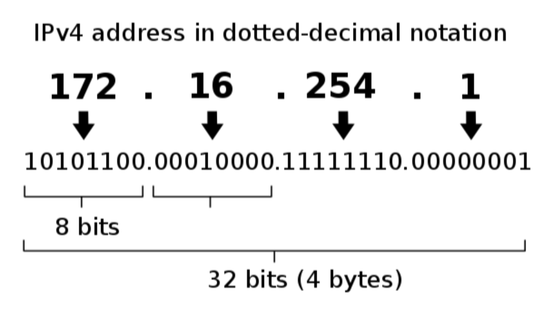
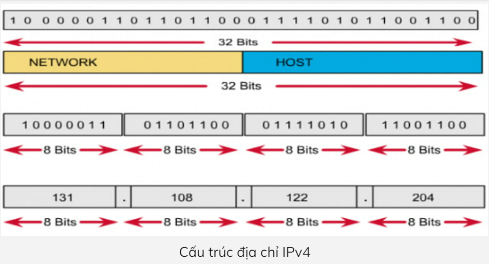
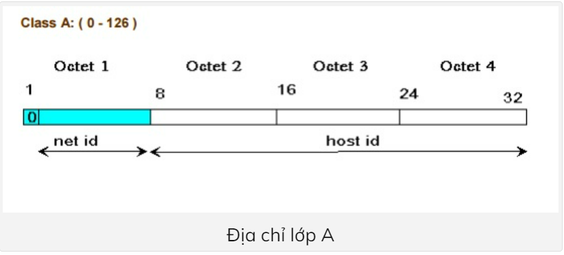
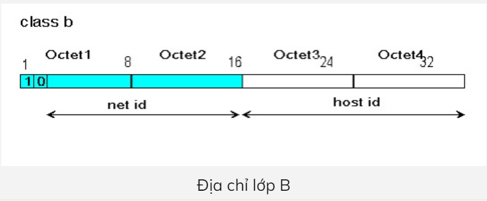
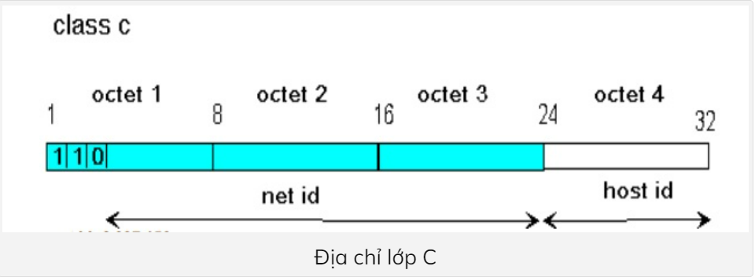
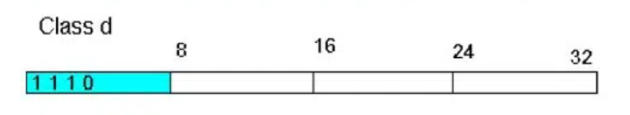
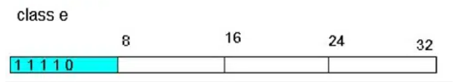

# Tìm hiểu về địa chỉ IPv4

## 1. Tổng quan địa chỉ IPv4

### 1.1 IPv4 là gì? 

__IPv4 là phiên bản IP thế hệ thứ 4__, nó được sử dụng nhiều nhất hiện nay bên cạnh IPv6. Hai phiên bản IP này là yếu tố chủ chốt cho việc giao tiếp giữa các thiết bị trong mạng Internet.

IPv4 là giao thức mang tính hướng dữ liệu và được sử dụng cho hệ thống chuyển mạch gói. IPv4 không quan tâm đến thứ tự truyền gói tin, cũng không đảm bảo gói tin sẽ đến được đích hay là có sảy ra tình trạng lặp gói tin ở đích đến hay không. Nó chỉ có cơ chế đảm bảo tính toàn vẹn dữ liệu bằng việc sử dụng những gói kiểm tra được thiết lập đi kèm với nó. 

Địa chỉ Ipv4 là 1 địa chỉ đơn nhất đang được sử dụng bởi các thiết bị điện tử hiện nay để nhận diện và liên lạc với nhau trên Internet. Để đánh địa chỉ, Ipv4 sử dụng 32bit và chia ra làm 4 octet (mỗi octet có 8 bit = 1 byte). Dấu chấm được sử dụng để ngăn các octet với nhau.

Để hiểu địa chỉ IPv4 là gì có thể lấy ví dụ như sau 172.16.254.1. Dải số này có thể dùng để đặt tên cho một địa chỉ IPv4 nào đó. Có thể thấy địa chỉ IPv4 có tổng cộng 4 số và mỗi số phải nằm trong giới hạn từ 0-255. 

Các loại địa chỉ IPv4: unicast, broadcast, multicast. Trong đó unicast là địa chỉ IP cho phép thiết bị gửi dữ liệu đến 1 nơi nhận duy nhất. Địa chỉ IP broadcast lại cho phép gửi dữ liệu đến các host trong 1 mạng con. Còn địa chỉ IP multicast cho phép thiết bị gửi dữ liệu đến 1 tập xác định trước các host.

### 1.2 Đặc điểm của địa chỉ IPv4

- IPv4 là một giao thức 32 bit
- IPv4 sử dụng phương pháp đánh địa chỉ số
- Dấu chấm (.) phân tách các bit nhị phân IPv4
- IPv4 có 12 trường tiêu đề
- IPv4 có tính năng hỗ trợ phát sóng
- VLSM (mặt nạ mạng con có độ dài thay đổi) được hỗ trợ bởi IPv4
- Địa chỉ IPv4 được ánh xạ đến địa chỉ MAC bằng ARP (giao thức phân giải địa chỉ)

### 1.3 Ưu điểm, nhược điểm của địa chỉ IPv4

**Ưu điểm**

- Giao thức không có kết nối.
- Cho phép tạo một lớp giao tiếp ảo đơn giản trên nhiều thiết bị.
- Nó chiếm ít bộ nhớ hơn và dễ dàng nghi nhớ các địa chỉ.
- Được hỗ trợ trên nhiều thiết bị.

**Nhược điểm**

- __Cấu trúc thiết kế__: Địa chỉ IPv4 có cấu trúc định tuyến phân cấp và không phân cấp. Mỗi Router phải giữ một bảng thông tin định tuyến lớn, điều này đòi hỏi một lượng lớn bộ nhớ. IPv4 cũng yêu cầu Router can thiệp nhiều vào các gói IPv4.
- __Thiếu hụt không gian địa chỉ__: Bởi vì địa chỉ IPv4 chỉ có 32 bit dẫn đến không gian địa chỉ IPv4 chỉ có 232 địa chỉ. Với tốc độ phát triển vượt bậc của Internet hiện nay, tài nguyên địa chỉ IPv4 gần như cạn kiệt.
- __Tính bảo mật và kết nối đầu cuối__: Không có bảo mật nào được tích hợp trong cấu trúc thiết kế của địa chỉ IPv4. Giao thức IPv4 không hỗ trợ mã hóa dữ liệu. Do đó, thay vì bảo mật lưu lượng giữa các Host, bảo mật ở mức ứng dụng hiện được sử dụng rộng rãi. 

## 2. Tại sao không có địa chỉ IPv1, v2, v3, v5

Vì những phiên bản IPv1, v2, v3 không được công nhận chính thức, không đáp ứng đủ nhu cầu người dùng vì thế được chuyển lên thành địa chỉ IPv4.

## 3. Cấu trúc và các thành phần của địa chỉ IPv4

### 3.1 Biểu diễn địa chỉ IPv4

Địa chỉ IPv4 sẽ có 32 bit và được biểu diễn thành một dãy số nhị phân và chia thành 4 cụm. Mỗi cụm như vậy được gọi là một [Octet](https://bkhost.vn/blog/octet/), mỗi octet sẽ là 8 bit và chúng được ngăn cách bằng dấu (.)
Về hình dáng, cấu trúc của địa chỉ IPv4 sẽ gồm 4 con số ở dạng thập phân tượng trưng cho 4 cụm. 

Địa chỉ IP được chia làm 2 phần:

- Network ID - địa chỉ mạng là địa chỉ được cấp cho từng mạng riêng.
- Host ID (hay Host address) là địa chỉ của thiết bị trong mạng.

### 3.2 Quy tắc đặt IPv4
Việc đặt địa chỉ IP phải tuân theo các quy tắc sau:

- Không được đặt những bit ở phần network bằng 0 cùng một lúc. Khi đặt tất cả những bit ở phần network bằng không thì địa chỉ IP sẽ có 3 số đầu là 0.0.0. Đây là một địa chỉ sai.
- Nếu đặt tất cả các bit ở phần host bằng 0 thì số cuối cùng của địa chỉ IP sẽ bằng 0. Khi đó địa chỉ đó là một địa chỉ mạng, không thể dùng làm host. Ví dụ: 191.168.10.0 là một địa chỉ mạng.
- Nếu đặt tất cả các bit ở phần host là 1 thì số cuối cùng của địa chỉ IP là 255. Khi đó địa chỉ này sẽ là một [địa chỉ broadcast](https://bkhost.vn/blog/dia-chi-broadcast/) của mạng đó. Ví dụ: 192.168.10.255 là một địa chỉ broadcast.

## 4. Các lớp của IPv4

Địa chỉ IP được chia thành 5 lớp A, B, C, D, E. Đặc điểm của các lớp như sau:

__Lớp A__

Địa chỉ lớp A có phần mạng là 8 bit đầu và phần host là 24 bit sau.
Bit đầu tiên của phần mạng luôn là 0. 
Lớp A sẽ có địa chỉ mạng từ 1.0.0.0 đến 126.0.0.0 
Phần host có 24 bit, mạng lớp A có 2^24^-2 host
Mạng lookback sẽ là 127.0.0.0 

**Lớp B**

Phần mạng 2 octet đầu, phần host 2 octet sau.
Hai bit đầu của một địa chỉ lớp B luôn được giữ là 1.0. 
Lớp B có dải địa chỉ từ 128.0.0.0 đến 191.255.0.0 
Lớp B có 2^16^-2 Host
 
__Lớp C__

Phần mạng - 3 octet đầu tiên, phần host - 1 octet sau.
3 bit đầu tiên của 1 địa chỉ lớp C luôn được giữ là 110
Dải địa chỉ từ 192.0.0.0 đến 223.255.255.0
Lớp C có 2^8^-2 = 254 Host

- Ví dụ: 192.168.252.0/16

  - Netmask: 255.255.0.0
  - Địa chỉ mạng: 192.168.0.0
  - Địa chỉ IP đầu tiên: 192.168.0.1
  - Địa chỉ IP cuối cùng: 192.168.255.254
  - Địa chỉ Broadcast: 192.168.255.255

__Lớp D__

4 bit đầu của octet đầu là 1110
Dải địa chỉ từ 224.0.0.0 đến 239.255.255.255
Được dùng làm địa chỉ multicast. Ví dụ 224.0.0.5 dùng cho OSPF; 224.0.0.9 sử dụng cho RIPv2.

__Lớp E__

Bao gồm các địa chỉ có oc-tet đầu tiên từ 240 đến 255 (240.0.0 đến 254.255.255.255). 
Lớp E được dành riêng cho công việc nghiên cứu.

___Lưu ý___:

- Lớp A từ 1 đến 126.
- Lớp B từ 128 đến 191.
- Lớp C từ 192 đến 223.
- Lớp D từ 224 đến 239.
- Lớp E từ 240 đến 255.

## 5. Phân biệt IP Public vs IP Private

| IP Public | IP Private|
|----------------|---------------|
| Địa chỉ IP public của hệ thống là địa chỉ IP được sử dụng để giao tiếp bên ngoài mạng. Địa chỉ IP public về cơ bản được gán bởi ISP (Nhà cung cấp dịch vụ Internet)| Địa chỉ IP private của hệ thống là địa chỉ IP được sử dụng để giao tiếp trong cùng một mạng. Thông tin hoặc dữ liệu IP private có thể được gửi hoặc nhận trong cùng một mạng|
| Phạm vi toàn cầu | Phạm vi cục bộ|
| Được sử dụng để giao tiếp bên ngoài mạng | Được sử dụng để giao tiếp trong mạng|
| Địa chỉ IP public có thể khác nhau theo một quy luật đồng nhất hoặc không đồng nhất|Địa chỉ IP private của các hệ thống được kết nối trong mạng sẽ khác nhau, nhưng vẫn theo một quy luật thống nhất|
| Được sử dụng để truy cập dịch vụ Internet | Chỉ hoạt động trong mạng [LAN](https://quantrimang.com/cong-nghe/mang-cuc-bo-lan-phan-i-304) |
| Được kiểm soát bởi ISP (nhà cung cấp dịch vụ Internet) | Được sử dụng để load hệ điều hành mạng |
| Không miễn phí | Có sẵn miễn phí|

Phạm vi IP Private:

| Lớp |Starting IP Address|Ending IP Address| Host|
|-----|----------|-----------|-----------|
|A|10.0.0.0|10.255.255.255|16777216|
|B|172.16.0.0|172.31.255.255|1048576|
|C|192.168.0.0|192.168.255.255|65536|

Phạm vi IP Public: ngoài các địa chỉ IP Private.

