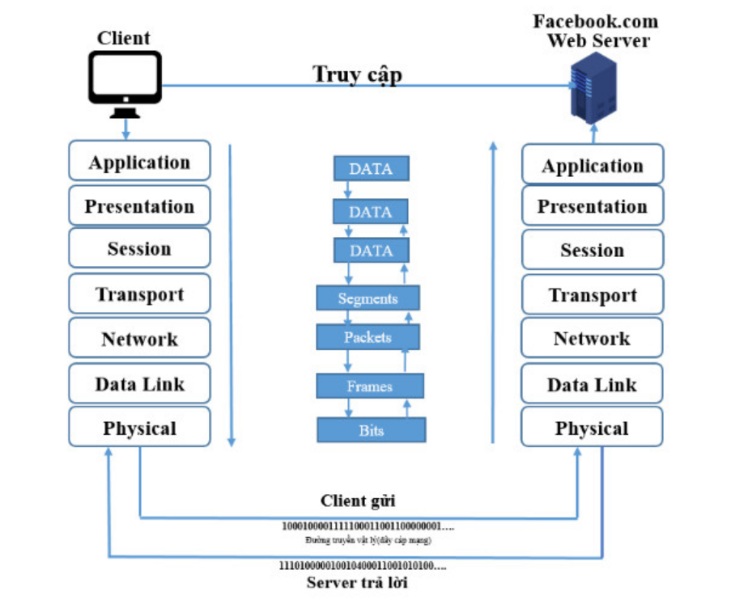

# Mô Hình OSI Là Gì? Nhiệm vụ và chức năng của 7 tầng OSI

Mô hình OSI đóng vai trò quan trọng trong lĩnh vực mạng máy tính và được dùng để mô tả các giao thức và chức năng trong một mạng máy tính. Trong bài viết này, chúng ta của cùng tìm hiểu [mô hình osi là gì](https://mikotech.vn/mo-hinh-osi-la-gi/), cấu trúc ra sao và có chức năng ra sao.

## 1. Mô hình OSI là gì? 

> __Mô hình OSI (Open Systems Interconnection)__ là một mô hình tham chiếu để mô tả cách mà các hệ thống mạng giao tiếp với nhau. Mô hình OSI phân chia quá trình giao tiếp mạng thành các tầng độc lập nhằm tăng tính tương thích và tách biệt giữa các phần của một hệ thống mạng.

Đây là một khung mô hình chuẩn được sử dụng trong lĩnh vực mạng máy tính. Mô hình được đề xuất bởi [Tổ chức Tiêu chuẩn Hóa Quốc tế (ISO)](https://vi.wikipedia.org/wiki/T%E1%BB%95_ch%E1%BB%A9c_ti%C3%AAu_chu%E1%BA%A9n_h%C3%B3a_qu%E1%BB%91c_t%E1%BA%BF) vào những năm 1980.

Vậy cụ thể mô hình OSI được chia ra thành mấy tầng? Mô hình này gồm có 7 lớp để giải quyết vấn đề trên:

1. Application
2. Presentation
3. Session
4. Transport
5. Network
6. Data link 
7. Physical

####Cách hoạt động mô hình OSI

__Bước 1: Đưa thông tin cần gửi vào máy tính__
Ở tầng Application (tầng 7), người dùng tiến hành đưa thông tin cần gửi vào máy tính. Các thông tin này thường có dạng như: hình ảnh, văn bản, số, ứng dụng trên điện di động, các dữ liệu mà các ứng dụng có thể hỗ trợ như google docs, google sheet…

Sau đó các dữ liệu này được đưa xuống tầng Presentation (tầng 6) để chuyển hóa các dữ liệu thành một dạng chung để mã hóa dữ liệu và nén dữ liệu.

Dữ liệu sau khi qua tầng 6 được chuyển xuống tầng Session (Tầng 5). Tầng phiên có chức năng bổ sung các thông tin cần thiết cho một phiên giao dịch (gửi-nhận) đồng thời.

__Bước 2: Tiếp theo, toàn bộ gói tin đang ở tầng 5 lại được đưa xuống tầng 4 (transport)__

Lúc này toàn bộ nội dung của gói tin lớp 7, 5, 6 sẽ được tầng 4 coi là 1 Data được đóng thêm một TCP header hoặc UDP header phần này sẽ được gọi là 1 segments, segments chứa 2 thành phần chính TCP/UDP header và data. Segments sẽ được đưa xuống tầng tiếp theo là tầng 3 network.

__Bước 3: Đóng thêm IP header vào Segments__

Tương tự tầng trên tầng 3 thực hiện đóng thêm 1 IP header vào Segments và được gọi với tên gọi khác Packet. Packet chứa IP header , TCP/UDP header và Data.

__Bước 4: Gói tin lần lượt được đưa xuống các tầng tiếp theo__

Tương tự như trên gói tin tiếp tục được đưa xuống tầng tiếp theo lần lượt Datalink, physical. Riêng ở layer 2, Data Link thì ngoài việc bọc thêm ethernet header lúc này sẽ được gọi là Frames nó còn bọc thêm phần kiểm tra lỗi FCS và xuống lớp vật lý. Đơn vị dữ liệu của lớp vật lý phải là các Bits. Tức là toàn bộ cấu trúc dữ liệu này sẽ được chuyển hóa thành một dòng Bit nhị phân để truyền trên đường truyền vật lý.

__Bước 5: Quá trình diễn ra ở đầu thu__

Ở phía đầu thu tức là ở bên máy chủ facebook.com thì quá trình lại diễn ra ngược lại tức là lúc này dòng Bit nhị phân được đưa vào đường truyền vật lý và truyền lên trên.

__Bước 6: Gói tin tiếp tụ được đẩy lên tầng trên Datalink__

Sau khi được truyền đến được máy chủ facebook.com với dãy bit 0100011000... Ở tầng physical thì nó sẽ được tiếp tục đẩy lên tầng trên Datalink. Bóc 1 lớp gói hàng ra được gọi ethernet header ra ở tầng Datalink gọi là lớp Frames và tương tự đẩy lên Tầng Network và bóc lớp Packets tương tự như vậy đến tầng transport bóc Segments và đẩy lên tầng trên của nó.

**Tóm tắt kiến thức cần nhớ** 

- Kết thúc quá trình trên hoàn thành 1 quá trình gửi dữ liệu từ người dùng đến 1 máy tính khác và máy tính trả lời thông tin người dùng mong muốn.Thông qua bước trên chúng ta sẽ hiểu rõ 1 phần nào về mô hình hoạt động mạng OSI.
- Trong quá trình này, người dùng gửi đi 1 đoạn văn bản hoặc hình ảnh,... máy tính sẽ chia nhỏ thành các gói tin và tất cả các gói tin này sẽ thực hiện các bước trên.
- Tại nơi người gửi, mỗi tầng coi gói tin của tầng trên gửi xuống là **dữ liệu được nhận - phải giữ gìn dữ liệu và thêm vào gói tin các thông tin điều khiển của của lớp mà đang thêm để nhận dạng** sau đó chuyển tiếp xuống tầng dưới. Tại nơi nhận, quá trình diễn ra ngược lại với quá trình gửi, mỗi tầng lại tách thông tin đã gắn vào và chuyển dữ liệu lên tầng trên tiếp tục tách các thông tin mà mỗi tầng đã gắn. 

## 2. Khái niệm, đặc điểm, chức năng của các lớp 

### 2.1 Lớp ứng dụng (Applycation Layer)

- __Lớp ứng dụng__ là cái mà người dùng có thể nhìn thấy bằng mắt được ví dụ như các ứng dụng được cài trên máy tính (Chrome,mozilla firefox,...) và môi trường truyền tin.
- Chức năng mà nó làm là chuyển file trong đó có giải quyết vấn đề không tương thích (tên file theo định dạng, mã hóa văn bản theo ngôn ngữ chung).
- Cung cấp các dịch vụ tiêu biểu cho người dùng: Web, Mail, DNS (phân giải tên miền), DHCP (cấp phát IP  động), FTP (truyền file dữ liệu: hình ảnh,văn bản,...).

Các giao thức mà lớp Application sử dụng để đáp ứng dịch vụ mà bạn có thể chưa biết đến: 

- HTTP (Hypertext Transfer Protocol): Phương thức sử dụng cho website.
- DNS (Domain Name System): Phân giải tên miền.
- SMTP (Simple Mail Transfer Protocol): Phương thức dùng để gửi và nhận email.
- SNMP (Simple Network Monitoring Protocol): Dùng trong quá trình giám sát 1 thiết bị phần cứng.
- FTP (File Transfer Protocol): Truyền file.
- NTP (Network Time Protocol): Đồng bộ hóa thời gian.

Lớp ứng dụng đóng vai trò quan trọng trong việc đáp ứng nhu cầu của người dùng và cho phép họ tương tác với các ứng dụng và dịch vụ mạng. Nó giúp quản lý việc truyền tải dữ liệu, xử lý lỗi và đảm bảo tính toàn vẹn của dữ liệu giữa người dùng và mạng.

### 2.2 Lớp trình diễn (Presentation Layer)

__Lớp trình diễn__ là lớp thứ sáu trong mô hình OSI. Lớp này đảm nhiệm vai trò chuyển đổi và xử lý dữ liệu từ định dạng của ứng dụng thành định dạng chuẩn để truyền qua mạng và ngược lại. Nó cung cấp các dịch vụ và các cơ chế chuyển đổi, mã hóa, nén và định dạng dữ liệu để đảm bảo rằng dữ liệu được truyền và nhận một cách chính xác, an toàn và hiệu quả.

Các chức năng chính của lớp trình diễn bao gồm:

- **Mã hóa/ Giải mã (Encryption/Decryption)**: Lớp trình diễn có khả năng mã hóa dữ liệu trước khi truyền và giải mã dữ liệu khi nhận. Điều này đảm bảo tính bảo mật trong quá trình truyền dữ liệu trên mạng.
- **Nén/ Giải nén (Compression/Decompression)**: Lớp trình diễn có khả năng nén dữ liệu để giảm dung lượng truyền và giải nén dữ liệu khi nhận. Điều này giúp tăng tốc độ truyền dữ liệu và giảm sử dụng băng thông mạng.
- **Định dạng dữ liệu (Data Formatting)**: Lớp trình diễn thực hiện việc định dạng dữ liệu từ định dạng của ứng dụng thành định dạng chuẩn để truyền qua mạng và ngược lại. Điều này đảm bảo tính tương thích giữa các ứng dụng và hệ thống khác nhau.
- **Quản lý phiên (Session Management)**: Lớp trình diễn có khả năng quản lý các thông tin phiên giao tiếp giữa các ứng dụng. Nó hỗ trợ việc khởi tạo, duy trì và kết thúc phiên giao tiếp, đồng bộ hóa các hoạt động truyền dữ liệu và xử lý lỗi.

### 2.3 Lớp phiên (Session Layer)

__Lớp phiên__ là lớp thứ năm trong mô hình OSI . Tầng này có trách nhiệm thiết lập, duy trì và kết thúc các phiên (sessions) giao tiếp giữa các ứng dụng trên mạng. Nó tạo ra một môi trường nhất quán cho việc thiết lập và duy trì phiên giao tiếp, đồng bộ hóa dữ liệu và chấm dứt phiên.

Các chức năng quan trọng của lớp phiên bao gồm:

- **Thiết lập phiên (Session establishment)**: Lớp phiên cho phép các ứng dụng thiết lập phiên giao tiếp giữa chúng trước khi truyền dữ liệu. Quá trình này bao gồm xác định và thiết lập các thông số phiên như các thông tin định danh, cấu hình và các thông tin điều khiển khác.
- **Duy trì phiên (Session maintenance)**: Lớp phiên đảm bảo việc duy trì và quản lý phiên giao tiếp giữa các ứng dụng. Nó kiểm soát việc truyền dữ liệu giữa các ứng dụng trong suốt thời gian phiên diễn ra, đồng bộ hóa dữ liệu và xử lý các yêu cầu và phản hồi.
- **Đồng bộ phiên (Session synchronization)**: Lớp phiên xác định các điểm đồng bộ trong quá trình truyền dữ liệu giữa các ứng dụng. Điều này đảm bảo rằng dữ liệu được truyền một cách nhất quán và đúng thứ tự giữa nguồn và đích.
- **Chấm dứt phiên (Session termination)**: Lớp phiên cho phép các ứng dụng kết thúc phiên giao tiếp một cách an toàn và đúng quy trình. Quá trình này bao gồm thông báo, truyền tải thông tin hoàn thành và giải phóng tài nguyên được sử dụng trong phiên.

### 2.4 Lớp giao vận (Transport Layer)

__Lớp giao vận__ là lớp thứ tư trong mô hình OSI, có trách nhiệm dữ liệu truyền đi là đáng tin cậy. Nó tạo điều kiện cho việc giao tiếp hiệu quả và đáng tin cậy giữa các ứng dụng, bất kể sử dụng các mạng hoặc thiết bị khác nhau.
Các chức năng quan trọng của tầng Giao vận bao gồm:

- __Điều khiển luồng (Flow Control)__: Lớp giao vận quản lý việc truyền dữ liệu giữa các ứng dụng và điều chỉnh tốc độ truyền để đảm bảo rằng không bị quá tải hoặc quá chậm so với nguồn tiêu thụ.
- __Điều khiển lỗi (Error Control)__: Lớp giao vận sử dụng các cơ chế kiểm soát lỗi như checksum và ACK/NACK để đảm bảo rằng dữ liệu được truyền một cách tin cậy và không bị lỗi.
- __Đánh số gói (Segmentation/Reassembly)__: Lớp giao vận chia nhỏ dữ liệu từ các ứng dụng thành các đơn vị gói tin (segment) và gắn số thứ tự vào mỗi gói. Khi nhận được, lớp giao vận ghép các đơn vị gói lại thành dữ liệu ban đầu.
- __Đa kết nối (Connection Multiplexing)__: Lớp giao vận hỗ trợ việc thiết lập và duy trì các kết nối mạng đa kết nối (multi-connection), cho phép nhiều ứng dụng trên cùng một thiết bị mạng gửi và nhận dữ liệu đồng thời.

### 2.5 Lớp mạng (Network layer)

Lớp mạng (Network Layer) là lớp thứ ba trong mô hình OSI. Lớp này có trách nhiệm quản lý việc định tuyến và chuyển tiếp dữ liệu giữa các mạng khác nhau trong hệ thống mạng. lớp Mạng cung cấp các dịch vụ cho lớp trên là lớp giao vận và lớp dưới là lớp liên kết dữ liệu.

Lớp mạng là lớp quan trọng trong __mô hình OSI__, vì nó đảm bảo việc định tuyến và chuyển tiếp dữ liệu giữa các mạng khác nhau. Các chức năng quan trọng của lớp mạng bao gồm:

- __Định tuyến (Routing)__: lớp mạng xác định đường đi tốt nhất cho việc truyền gói tin từ nguồn đến đích qua các mạng khác nhau. Nó sử dụng các thuật toán định tuyến như RIP (Routing Information Protocol) và OSPF (Open Shortest Path First) để quyết định đường đi tối ưu.
- __Chuyển tiếp (Forwarding)__: lớp mạng thực hiện chuyển tiếp gói tin từ đầu vào đến đầu ra thông qua các thiết bị định tuyến (router). Các thiết bị định tuyến sử dụng bảng định tuyến để xác định cách chuyển tiếp gói tin đến đích.
- __Địa chỉ IP (IP Addressing)__: lớp mạng sử dụng địa chỉ IP để định danh và định vị các thiết bị trong mạng. Địa chỉ IP là một địa chỉ duy nhất cho mỗi thiết bị mạng và nó được sử dụng để xác định nguồn và đích của gói tin.
- __Fragmentation và Reassembly__: lớp mạng có khả năng phân mảnh (fragmentation) gói tin thành các phần nhỏ hơn để truyền qua các mạng có độ dài giới hạn. Ngược lại, nó cũng có khả năng ghép (reassembly) các phần nhỏ thành gói tin ban đầu khi gói tin đến đích.

### 2.6 Lớp liên kết dữ liệu (Data link layer)

**Lớp liên kết dữ liệu** là lớp thứ hai trong __mô hình OSI__. Nó chịu trách nhiệm cho việc truyền dữ liệu an toàn qua các đường truyền vật lý và xác định địa chỉ vật lý (MAC address). Lớp liên kết dữ liệu cung cấp các dịch vụ cho lớp mạng và có hai phân lớp con:

- **Lớp LLC (Logical Link Control)**: Lớp LLC quản lý các quy tắc truyền thông đồng bộ và không đồng bộ, kiểm soát lỗi và kiểm tra tính toàn vẹn của dữ liệu. Nó đảm bảo việc truyền thông tin một cách tin cậy giữa các điểm cuối trên cùng một mạng liên kết.
- **Lớp MAC (Media Access Control)**: Lớp MAC xác định cách truy cập vào phương tiện truyền thông chia sẻ, chẳng hạn như mạng LAN Ethernet. Nó quản lý việc gán địa chỉ vật lý (MAC address) cho các thiết bị mạng và xử lý việc truyền dữ liệu giữa các đầu cuối trên cùng một mạng.

Lớp liên kết dữ liệu có các chức năng quan trọng sau:

- __Đóng gói dữ liệu__: lớp này chia dữ liệu từ tầng mạng thành các khung dữ liệu nhỏ hơn để truyền qua đường truyền vật lý.
- **Định địa chỉ vật lý**: lớp Liên kết dữ liệu sử dụng địa chỉ MAC để xác định nguồn và đích của các khung dữ liệu.
- **Kiểm soát lỗi**: lớp này thực hiện kiểm tra lỗi, phát hiện và xử lý các vấn đề liên quan đến sự mất mát hoặc hỏng hóc dữ liệu ở tầng Vật lý.
- __Kiểm soát truy cập vào phương tiện truyền thông__: lớp liên kết dữ liệu quản lý quy tắc truy cập vào môi trường chia sẻ, đảm bảo rằng các thiết bị không xung đột và có thể truyền dữ liệu một cách hiệu quả.

### 2.7 Lớp vật lý ( Physical layer)

__Lớp vật lý (Physical Layer)__ là lớp thấp nhất trong __mô hình OSI__, đảm bảo việc truyền dữ liệu qua môi trường vật lý và không quan tâm đến nội dung hay ý nghĩa của dữ liệu. Nó tạo ra một đường truyền vật lý ổn định và đáng tin cậy để các lớp cao hơn có thể gửi và nhận các gói tin dữ liệu.

Nhiệm vụ của lớp vật lý bao gồm:

- **Truyền dữ liệu**: lớp vật lý biến các bit thành tín hiệu vật lý để truyền qua các phương tiện truyền thông như cáp đồng trục, cáp xoắn đôi, cáp quang hay sóng vô tuyến. Nó xác định các quy tắc về tốc độ truyền, đồng bộ hóa, kích thước khung dữ liệu, phạm vi tín hiệu và các thông số vật lý khác.
- **Điều khiển tín hiệu**: lớp lật lý quản lý các tín hiệu điều khiển như tín hiệu báo động, tín hiệu đồng bộ, tín hiệu kiểm tra lỗi, và tín hiệu điều chỉnh tốc độ truyền dữ liệu.
- **Định dạng dữ liệu**: lớp lật lý xác định cấu trúc và định dạng của dữ liệu trong từng bit, ví dụ như định dạng NRZ (Non-Return-to-Zero), Manchester, AMI (Alternate Mark Inversion) và các phương pháp khác.
- **Mã hóa và giải mã**: Lớp vật lý thực hiện mã hóa và giải mã các tín hiệu để đảm bảo việc truyền dữ liệu chính xác.

# 3. Workflow với mô hình OSI

Ví dụ: Các bước khi mà A muốn gửi 1 thông tin đến B 

### 3.1 Phía A gửi

__Bước 1__: Người dùng A gửi xuống 1 dữ liệu người dùng (user data). Dữ liệu người dùng này sẽ đi vào lớp đầu tiên là lớp Application và nó được đóng thêm một Layer 7 Header (là phần mào đầu, là thông tin quản lý của một gói tin). Một gói tin sẽ gồm có 2 phần là dữ liệu và header

__Bước 2__: Sau đó thông tin dữ liệu này được chuyển xuống lớp Presentation (lớp 6) để chuyển các dữ liệu thành một dạng chung để mã hóa dữ liệu và nén dữ liệu.

__Bước 3__: Dữ liệu tiếp tục được chuyển xuống lớp Session (lớp 5). Lớp này là tầng phiên có chức năng bổ sung các thông tin cần thiết cho phiên giao dịch (gửi- nhận) này. Các bạn có thể hiêu nôm na là lớp phiên cũng giống như các cô nhân viên ngân hàng làm nhiệm vụ xác nhận, bổ sung thông tin giao dịch khi bạn chuyển tiền tại ngân hàng.

__Bước 4__: Sau khi lớp Session thực hiện xong nhiệm vụ, nó sẽ tiếp tục chuyển dữ liệu này xuống lớp Transport (lớp 4). Tại lớp này, dữ liệu được cắt ra thành nhiều Segment và cũng làm nhiệm vụ bổ sung thêm các thông tin về phương thước vận chuyển dữ liệu để đảm bảo tính bảo mật, tin cậy khi truyền trong mô hình mạng.

__Bước 5__: Dữ liệu sẽ được chuyển xuống lớp Network (lớp 3). Ở lớp này, các segment lại tiếp tục được cắt ra thành nhiều gói Package khác nhau và bổ sung thông tin định tuyến. Lớp Network này chức năng chính của nó là định tuyến đường đi cho gói tin chứa dữ liệu.

__Bước 6__: Dữ liệu tiếp tục được chuyển xuống lớp Data Link (lớp 2). Tại lớp này, mỗi Package sẽ được băm nhỏ ra thành nhiều Frame và bổ sung thêm các thông tin kiểm tra gói tin chứa dữ liệu để kiểm tra ở máy nhận.

Tương tự, gói tin được truyền từ lớp trên xuống dưới sẽ được gắn thêm 1 Header của lớp đó, có nghĩa là toàn bộ gói tin của lớp trên sẽ là dữ liệu của gói tin lớp dưới. Riêng ở Layer 2 gói tin sẽ được gắn thêm phần kiểm tra lỗi FCS.

__Bước 7__: Khi đi xuống tới lớp vật lý, các gói tin sẽ được chuyển thành một chuỗi các bit nhị phân (0 1 ...) và được đưa lên cũng như phá tín hiệu trên các phương tiện truyền dẫn (dây cáp đồng, cáp quang,...) để truyền dữ liệu đến máy nhận.  

### 3.2 Phía B nhận

__Bước 1__: Lớp Physical (lớp 1) phía máy nhận B sẽ kiểm tra quá trình đồng bộ và đưa các chuỗi bit nhị phân nhận được vào vùng đệm. Chuỗi bit nhị phân khi được truyền lên lớp data link sẽ được chuyển thành cấu trúc dạng khung. 

__Bước 2__: Tiếp đó lớp Data Link sẽ tiến hành kiểm tra các lỗi trong frame mà bên máy gửi A tạo ra bằng cách kiểm tra FCS có trong gói tin được gắn bên phía máy nhận B. Nếu có lỗi xảy ra thì frame đó sẽ bị hủy bỏ. Sau đó kiểm tra địa chỉ lớp Data Link (Địa chỉ MAC Address) xem có trùng với địa chỉ của máy nhận B hay không. Nếu đúng thì lớp Data Link sẽ thực hiện gỡ bỏ Header của lớp Data Link để tiếp tục chuyển lên lớp Network.

__Bước 3__: Lớp Network sẽ tiến hành kiểm tra xem địa chỉ trong gói tin này có phải là địa chỉ của máy nhận B hay không. (Lưu ý: địa chỉ ở lớp này là địa chỉ IP). Nếu đúng địa chỉ máy nhận, lớp Network sẽ gỡ bỏ Header của nó và tiếp tục chuyển đến lớp Transport để tiếp tục qui trình.

__Bước 4__: Ở lớp Transport sẽ hỗ trợ phục hồi lỗi và xử lý lỗi bằng cách gửi các gói tin ACK, NAK (gói tin dùng để phản hồi xem các gói tin chứa dữ liệu đã được gửi đến máy nhận hay chưa?). Sau khi phục hồi sửa lỗi, lớp này tiếp tục sắp xếp các thứ tự phân đoạn và đưa dữ liệu đến lớp Session.

__Bước 5__: Lớp Session làm nhiệm vụ đảm bảo các dữ liệu trong gói tin nhận được toàn vẹn. Sau đó tiến hành gỡ bỏ Header của lớp Session và tiếp tục gửi lên lớp Presentation.

__Bước 6__: Lớp Presentation sẽ xử lý gói tin bằng cách chuyển đối các định dạng dữ liệu cho phù hợp. Sau khi hoàn thành sẽ tiến hành gửi lên lớp Application.

__Bước 7__: Lớp Application tiến hành xử lý và gỡ bỏ Header cuối cùng. Khi đó ở máy nhận B sẽ nhận được dữ liệu của gói tin được truyền đi.

_Tài liệu tham khảo_:
_[mikotech.vn](https://mikotech.vn/mo-hinh-osi-la-gi/)_
_[totolink.vn](https://www.totolink.vn/article/136-mo-hinh-osi-la-gi-chuc-nang-cua-cac-tang-giao-thuc-trong-mo-hinh-osi.html)_
_[hainguyenit.edubit.vn](https://hainguyenit.edubit.vn/blog/mo-hinh-osi-de-hieu-cho-nguoi-moi-hoc-mang)_
_[digistar.vn](https://www.digistar.vn/quy-trinh-truyen-goi-tin-trong-mo-hinh-osi/)_
