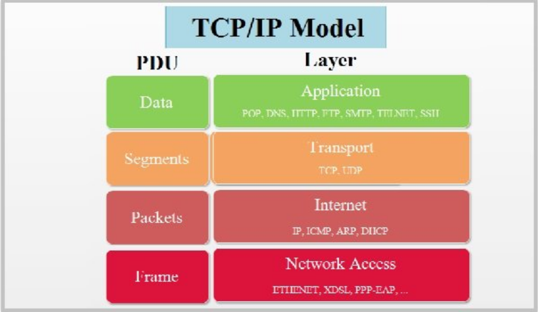
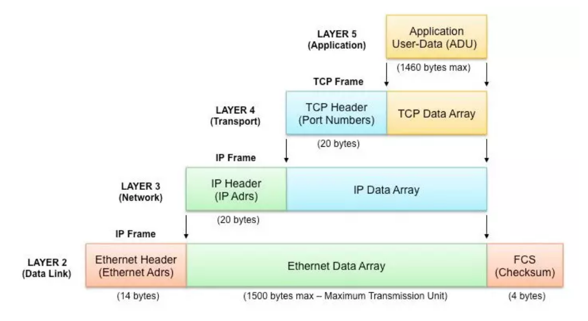
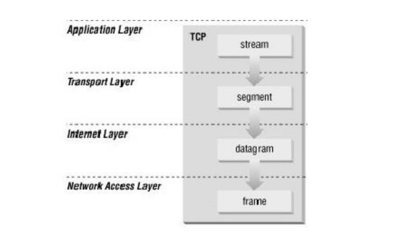
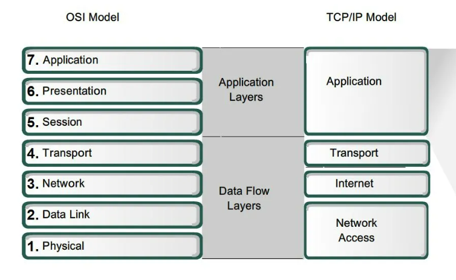
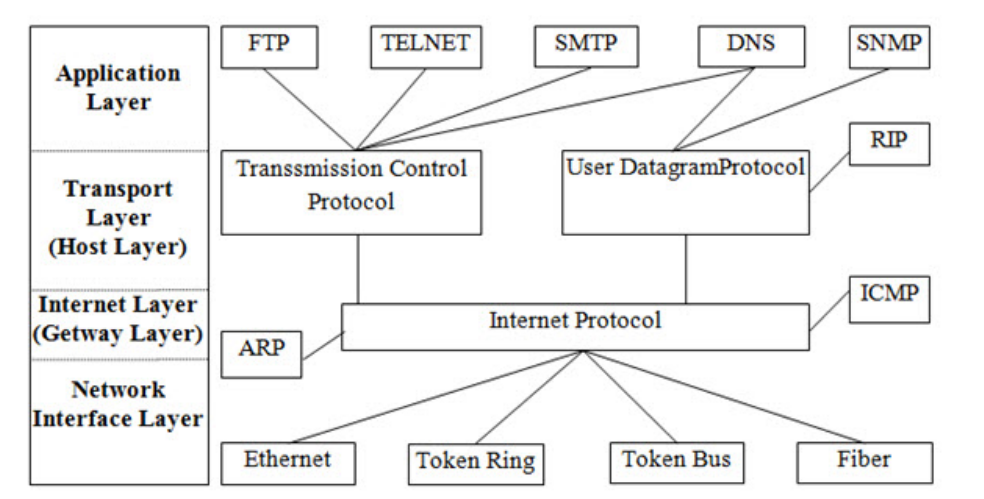
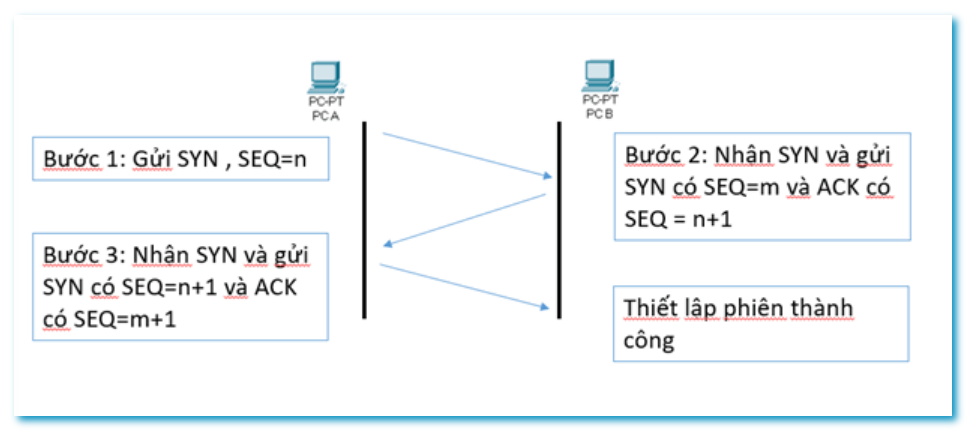
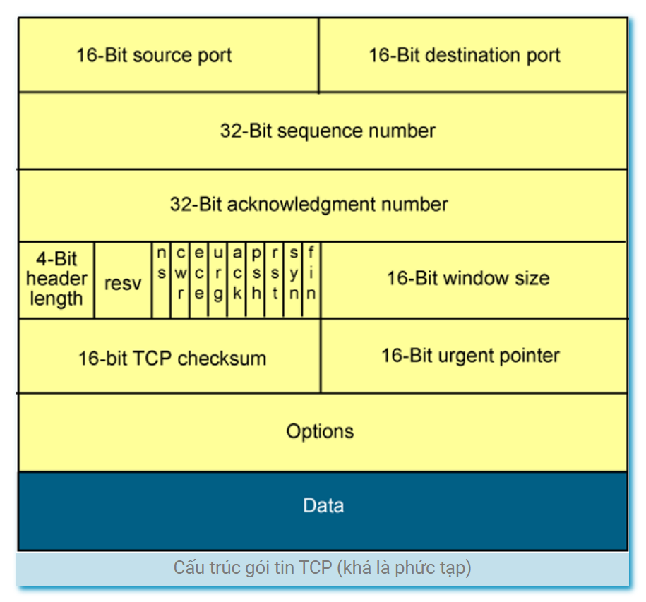
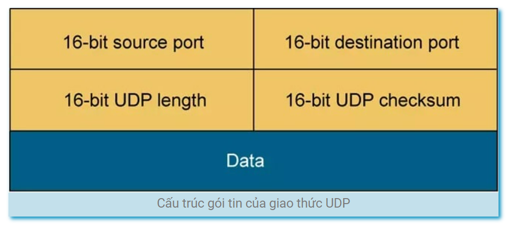

# Tìm hiểu cơ bản về mô hình TCP/IP

## 1. Mô hình TCP/IP

TCP/IP là viết tắt của cụm từ Transmission Control Protocol/Internet Protocol, là một tập hợp các giao thức (protocol) trao đổi thông tin được sử dụng để truyền tải và kết nối các thiết bị trong mạng Internet. Cụ thể hơn, TCP/IP chỉ rõ cho chúng ta cách thức đóng gói thông tin (còn được gọi là gói tin), được gửi và nhận bới các máy tính khác nhau. 

Mô hình TCP IP tiêu chuẩn gồm có 4 tầng chồng lên nhau theo thứ tự như sau: 1 Tầng vật lý (Physical) > 2 Tầng mạng (Network) > 3 Tầng giao vận (Transport) > 4 Tầng ứng dụng (Application).

### 1.1 Cách thức hoạt động của TCP/IP

Khi truyền dữ liệu , quá trình tiến hành từ tầng trên xuống tầng dưới, qua mỗi tầng dữ liệu được thêm vào thông tin điều khiển gọi là Header. Khi nhận dữ liệu thì quá trình xảy ra ngược lại, dữ liệu được truyền từ tầng dưới lên và qua mỗi tầng thì phần header tương ứng sẽ được lấy đi và khi đến tầng trên cùng thì dữ liệu không còn phần header nữa.

- Ở đây, IP có vai trò quan trọng, nó cho phép các gói tin được gửi đến đích đã định sẵn, bằng cách thêm các thông tin dẫn đường (chính là Header) vào các gói tin để các gói tin được đến đúng đích đã định sẵn ban đầu.
- Giao thức TCP đóng vai trò kiểm tra và đảm bảo sự an toàn cho mỗi gói tin khi đi qua mỗi trạm. Trong quá trình này, nếu giao thức TCP nhận thấy gói tin bị lỗi, một tín hiệu sẽ được truyền đi và yêu cầu hệ thống gửi lại một gói tin khác. 

- Tầng ứng dụng: dữ liệu là các luồng được gọi là stream.
- Tầng giao vận: đơn vị dữ liệu mà TCP gửi xuống tầng dưới gọi là TCP segment.
- Tầng mạng: dữ liệu mà IP gửi xuống tầng dưới gọi là IP datagram.
- Tầng liên kết: dữ liệu được truyền đi gọi là frame.

## 2. Đặc điểm, chức năng của các tầng trong mô hình TCI/IP

### 2.1 Tầng ứng dụng (Application)

Đây là tầng trên cùng của mô hình TCP/IP; tầng ứng dụng có vai trò:

- Nó cung cấp giao tiếp đến người dùng
- Cung cấp các ứng dụng cho phép người dùng trao đổi dữ liệu ứng dụng thông qua các dịch vụ mạng khác nhau (như duyệt web, chat, gửi email,...).
- Dữ liệu khi đến đây sẽ được định dạng theo kiểu byte nối byte, cùng với đó là các thông tin định tuyến giúp xác định đường đi đúng của một gói tin.

Một số giao thức trao đổi dữ liệu:

- FTP (File Transfer Protocol): giao thức chạy trên nền TCP cho phép truyền các file ASCII hoặc nhị phân theo 2 chiều.
- TFTP (Trival File Transfer Protocol) : giao thức truyền file chạy trên nền UDP.
- SMTP ( Simple Mail Transfer Protocol) : giao thức dùng để phân phối thư điện tử.
- Telnet : cho phép truy nhập từ xa để cấu hình thiết bị.
- SNMP (Simple Network Managerment Protocol) : Là ứng dụng chạy trên nền UDP , cho phép quản lý và giám sát các thiết bị mạng từ xa.
- Domain Name System ( DNS) : Là giao thức phân giải tên miền, được sử dụng trong hỗ trợ truy nhập Internet.

### 2.2 Tầng giao vận (Transport)

Chức năng chính của tầng 3 là xử lý vấn đề giao tiếp giữa các máy chủ trong cùng một mạng hoặc khác mạng được kết nối với nhau thông qua bộ định tuyến. Tại đây dữ liệu sẽ được phân đoạn, mỗi đoạn sẽ không bằng nhau nhưng kích thước phải nhỏ hơn 64KB. Cấu trúc đầy đủ của một Segment lúc này là Header chứa thông tin điều khiển và sau đó là dữ liệu.

Tầng này có 2 giao thức chính là TCP (Transmisson Control Protocol) và UDP (User Datagram Protocol):

- TCP sẽ đảm bảo chất lượng truyền gửi gói tin, nhưng tốn khá nhiều thời gian để kiểm tra đầy đủ thông tin từ thứ tự dữ liệu cho đến việc kiểm soát vấn đề tắc nghẽn lưu lượng dữ liệu.
- Trái với TCP, UDP có thấy tốc độ truyền tải nhanh hơn nhưng lại không đảm bảo được chất lượng dữ liệu được gửi đi (tức là nó không quan tâm dữ liệu có đến được đích hay không).

### 2.3 Tầng mạng (Internet)

Tầng này đảm nhận việc truyền tải dữ liệu một cách hợp lý, logic. Các phân đoạn dữ liệu sẽ được đóng gói với kích thước phù hợp; đồng thời được chèn thêm Header chứa thông tin của tầng mạng và tiếp tục được chuyển sang tầng tiếp theo.

Các giao thức chính trong tầng mạng gồm: IP (Internet Protocol), ICMP (Internet Control Message Protocol) và IGMP (Internet Group Message Protocol).

### 2.4 Tầng vật lý (Network Access)

Đây là tầng thấp nhất trong mô hình TCP IP, nó là sự kết hợp của tầng Data Link và Physical trong mô hình OSI (Mô hình này các bạn tìm hiểu thêm nhé. Bản chất nó cũng tương tự như TCP/IP). 
Chịu trách nhiệm truyền dữ liệu giữa các thiết bị trong cùng một mạng. Tại đây, các gói dữ liệu được đóng vào khung (Frame) và được định tuyến đi đến đích được chỉ định ban đầu.

## 3. So sánh với mô hình OSI

__Giống nhau__:

- OSI và TCP/IP đều có kiến trúc phân lớp.
- OSI và TCP/IP đều có các chức năng tương tự của lớp Transport và lớp Network.
- OSI và TCP/IP cùng sử dụng kỹ thuật chuyển Packet
  
__Khác nhau__:

| Nội dung | Mô hình OSI | Mô hình TCP/IP |
|----------|-------------|-----------------|
| Độ tin cậy và phổ biến | Nhiều người cho rằng đây là mô hình cũ, chỉ để tham khảo, số người sử dụng hạn chế hơn so với TCP/IP | Được chuẩn hóa, nhiều người tin cậy và sử dụng phổ biến trên toàn cầu |
| Phương pháp tiếp cận | Tiếp cận theo chiều dọc | Tiếp cận theo chiều ngang | 
| Sự kết hợp giữa các tầng | Mỗi tầng khác nhau thực hiện một nhiệm vụ khác nhau, không có sự kết hợp giữa bất cứ tầng nào | Trong tầng ứng dụng có tầng phiên và tầng trình diễn kết hợp với nhau | 
| Thiết kế | Phát triển mô hình trước sau đó sẽ phát triển giao thức | Các giao thức được thiết kế trước sau đó phát triển mô hình | 
| Số lớp | 7 lớp | 4 lớp |
| Truyền thông | Hỗ trợ cả kết nối định tuyến và không dây | Hỗ trợ truyền thông không kết nối từ tầng mạng |
| Tính phụ thuộc | Giao thức độc lập | Phụ thuộc vào giao thức |

## 4. Workflow với mô hình TCP/IP

__Lớp ứng dụng__: FTP truyền file, SMTP phân phối email, HTTP truyền nội dung giữa hai máy...
__Lớp truyền tải__: TCP đảm bảo dữ liệu truyền ổn định, đảm bảo bảo mật. UDP giúp tốc độ truyền tải tăng nhanh hơn. 
__Lớp Internet__: IP gán địa chỉ cho dữ liệu trước khi truyền nhận tới các đích đến. Giao thức ICMP báo lỗi khi dữ liệu truyền nhận bị hỏng.
__Lớp kết nối__: Dùng giao thức Ethernet, Wifi, Token Ring…

**Giao thức TCP**: Vì TCP là giao thức truyền tải hướng kết nối, nghĩa là trước khi kết nối phải thực hiện thiết lập kết nối đầu xa. Tiến trình này được gọi là tiến trình bắt tay 3 bước.

__Bước 1__: Phân đoạn dữ liệu: Trước khi gửi dữ liệu, TCP chia nó thành các phân đoạn nhỏ hơn, mỗi phân đoạn có kích thước tối đa là MSS (Maximum Segment Size).

__Bước 2__: Thiết lập kết nối: Trước khi truyền dữ liệu, hai máy tính cần thiết lập một kết nối TCP thông qua quá trình bắt tay ba bước (three-way handshake). Quá trình này bao gồm việc gửi tin nhắn SYN, SYN-ACK và ACK để xác nhận kết nối. 
Cụ thể: Giả sử máy tính PC A muốn truyền dữ liệu đến PC B, thì đầu tiên PC A phải thiết lập kết nối TCP tới Host B thông qua quá trình bắt tay 3 bước:
Bước 1: PC A phải gửi cho PC B một gói tin có cờ SYN được bật lên, với số thứ tự được đánh là n.
Bước 2: PC B nhận được gói tin SYN của PC A thì nó gửi lại gói tin có cờ SYN có số thứ tự SEQ là m, kèm theo cờ ACK có số thứ tự SEQ là n+1 để xác nhận.
Bước 3: PC A nhận được SYN từ B sẽ gửi lại gói tin với SYN có số thứ tự SEQ là n+1 kèm theo cờ ACK có số thứ tự SEQ là m+1

Như vậy ta có thể thấy được, TCP có cơ chế ACK (Acknowledgement) dùng để xác nhận dữ liệu đã được truyền tới đích hay chưa và cơ chế đánh số thứ tự gói tin (Sequencing) mục đích là để lắp ráp các gói tin chính xác ở thời điểm gửi và nhận gói tin tránh bị trùng lặp.

Nếu không nhận được phản hồi nó sẽ gửi lại gói tin để đảm bảo quá trình không bị thất thoát. Chính vì vậy dữ liệu sẽ không bị mất trên đường truyền, nhưng bù lại tốc độ truyền tải dữ liệu sẽ bị chậm.

__Giao thức UDP__: là giao thức truyền tải hướng không kết nối

Giao thức UDP không có quá trình bắt tay 3 bước như giao thức TCP, mà thay vào đó, nó sẽ truyền dữ liệu ngay lập tức, bỏ qua cơ chế xác thực cũng như đánh số thứ tự cho các gói tin.

Các gói tin liên tục được gửi cho bên nhận, bên gửi không cần “phải chờ” xem bên nhận đã nhận được hay chưa, mà cứ tiếp tục gửi tiếp.

Chính vì vậy, nếu bên nhận có bị mất một vài gói tin thì coi như sẽ bị mất (bên gửi sẽ không gửi lại), đó cũng là lý do tại sao những ứng dụng dùng giao thức UDP sẽ rất nhanh, vì nó đã bỏ qua bước kiểm tra lỗi khi truyền gói tin.

__Bước 3__: Truyền dữ liệu: Sau khi kết nối đã được thiết lập, dữ liệu sẽ được truyền từ máy tính nguồn đến máy tính đích thông qua các gói tin TCP. Mỗi gói tin đi kèm với một số thứ tự để đảm bảo dữ liệu được gửi và nhận đúng thứ tự.

__Bước 4__: Xác nhận và kiểm tra lỗi: Sau khi một gói tin được nhận, máy tính đích sẽ gửi một ACK (acknowledgment) trở lại máy tính nguồn để xác nhận việc nhận dữ liệu. Nếu máy tính nguồn không nhận được ACK trong thời gian định trước, nó sẽ gửi lại gói tin đó.

__Bước 5__: Đóng kết nối: Khi quá trình truyền dữ liệu hoàn tất, hai máy tính cần đóng kết nối bằng cách gửi tin nhắn FIN và ACK. Quá trình này được gọi là four-way handshake.

------

_Tài liệu tham khảo_
[1] https://fptcloud.com/tcp-ip-la-gi
[2][https://blogchiasekienthuc.com](https://blogchiasekienthuc.com/thu-thuat-internet/tcp-la-gi-va-udp-la-gi.html)
[3][https://voer.edu.vn](https://voer.edu.vn/c/mo-hinh-tcpip/5cfab6af/e92d1c3d)
[4][https://xaydungso.vn/blog](https://xaydungso.vn/blog/tim-hieu-giao-thuc-tcpip-la-gi-va-cac-ung-dung-thuc-tien-vi-cb.html?fbclid=IwAR34LNdC1doFKxpqeimzZZmMwML94alreigg7Oe_vQXtVZhJcsBG_7CgJaE#0)
[5][https://www.bkns.vn](https://www.bkns.vn/so-sanh-mo-hinh-osi-va-tcp-ip.html)